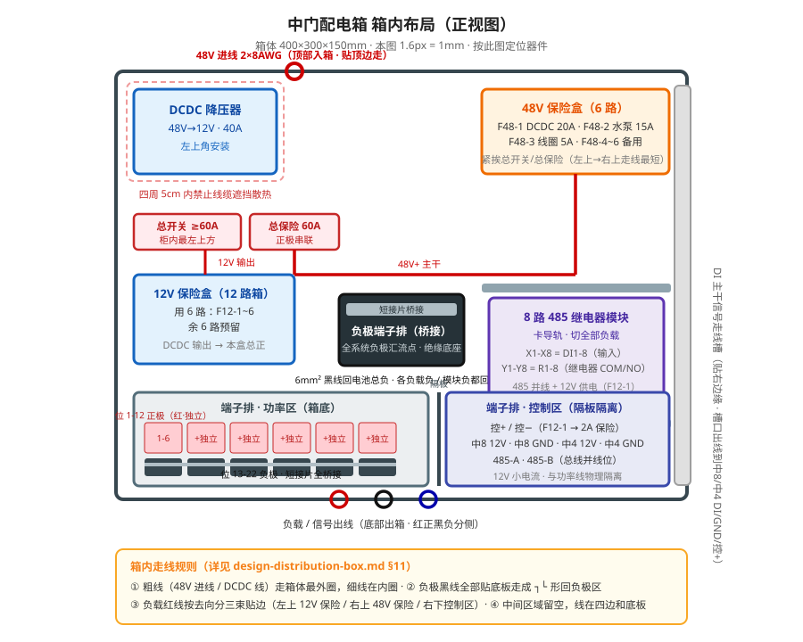
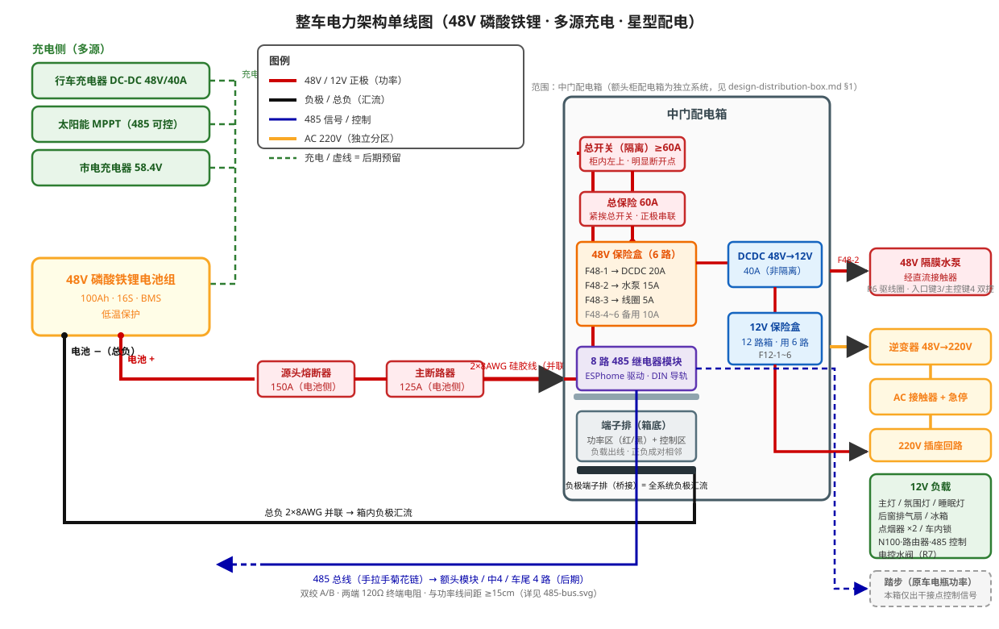
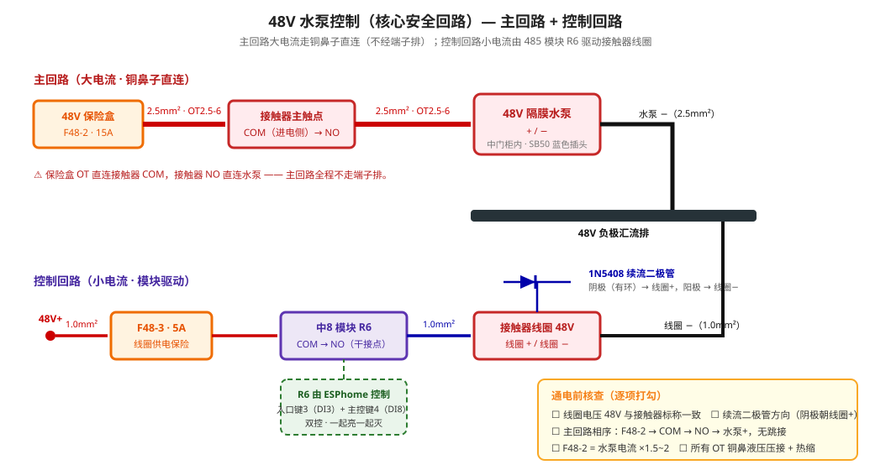
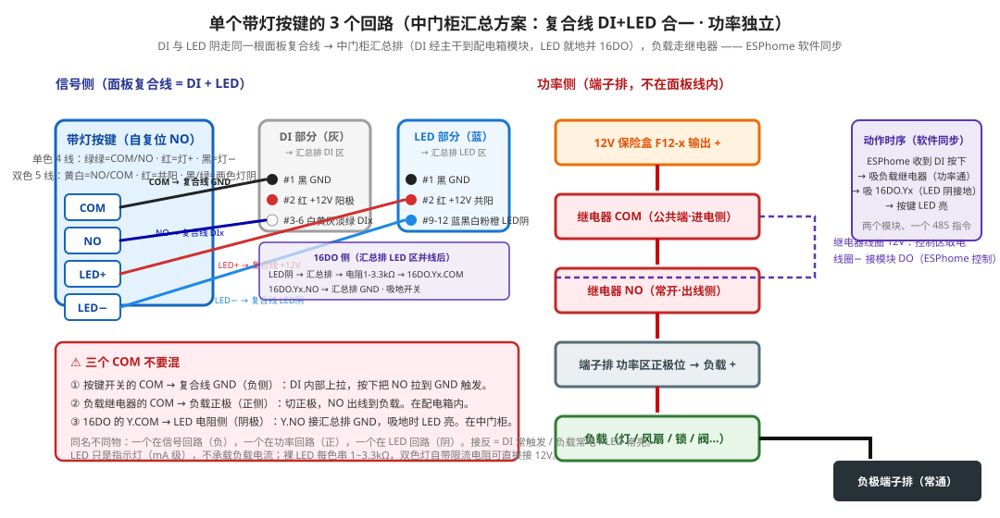
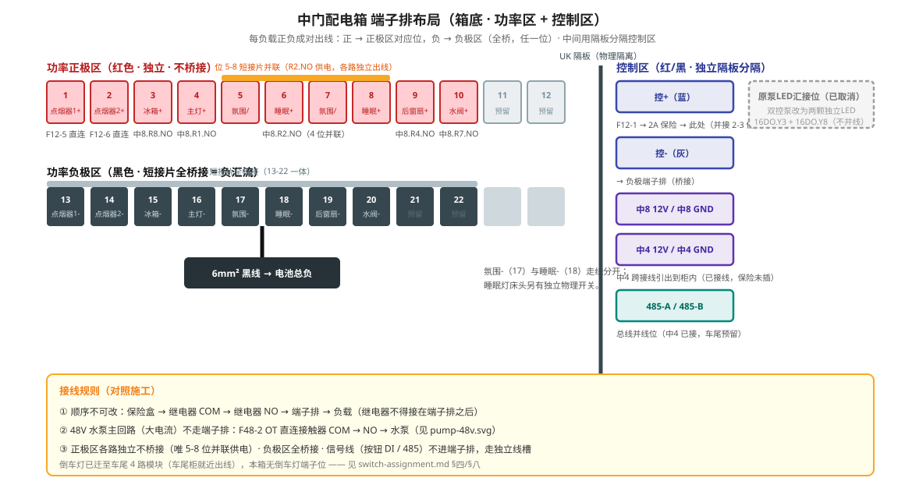

# 中门智能配电箱

## 一、系统边界与物理布局

| 区域 | 归属 | 说明 |
|------|------|------|
| 额头柜配电箱 | 独立系统 | 48V 降压供点烟口、原车鼓风机、DSP、低音炮、MPPT 等，与本箱无关 |
| 中门配电箱 | 本方案范围 | 48V 进线 → 48V 水泵 + DCDC 降压 → 12V 灯/风扇/冰箱/控制 |
| 踏步 | 功率接原车电瓶 | 本箱仅出干接点控制信号 |
| 车内锁 | 12V 供电 | 由本箱 12V 回路经继电器控制 |

### 1.1 箱内物理布局



```
┌─────────────────────────────────────────────────────┐
│  [降压器]          [48V保险盒]                       │
│  48V→12V           48V总分配+保护                    │
│                                                      │
│  [12V保险盒]        [负极端子排(桥接)]                    │
│  12V分配+保护       全系统负极汇流点                   │
│                                                      │
│  [8路485继电器模块] 右下，切所有负载                   │
│                                                      │
│  [端子排 功率区]    [端子排 控制区]                    │
│  底部               底部                              │
└─────────────────────────────────────────────────────┘
```

| 位置 | 设备 | 功能 |
|------|------|------|
| 左上 | 降压器 | 48V→12V 转换，40A |
| 右上 | 48V 保险盒 | 48V 总分配 + 保护 |
| 中左 | 12V 保险盒 | 12V 分配 + 保护 |
| 中部 | 负极端子排 | 黑端子 + 短接片桥接，暂代铜排；全系统负极汇流点 |
| 右下 | 8 路 485 继电器模块 | 逻辑控制 + 功率切换（详见 switch-assignment.md） |
| 底部 | 端子排 | 红色正极区 + 黑色负极区（桥接）+ 控制区（红/黑） |

### 1.2 架构图

> 本箱上游链路：电池 + → 源头熔断器 150A → 主断路器 125A（均在电池侧）→ 2×8AWG → 本箱总开关/总保险。整车全景见 [power-architecture.svg](./diagrams/power-architecture.svg)。



```
48V 电池组
    │
    ├──→ 2×8AWG ──→ [中门配电箱]
    │                   │
    │              [总开关 60A] ──→ [总保险 60A]
    │                   │
    │     ┌─────────────┼─────────────┐
    │     │             │             │
    │  48V保险盒      48V保险盒      DCDC 40A
    │  (动力回路)     (控制/备用)    降压模块
    │     │             │             │
    │  上水泵          接触器线圈    12V输出
    │  (经接触器)     48V供电       │
    │     │                         ▼
    │     │                    [12V保险盒]
    │     │                         │
    │     │         ┌───────────────┼───────────────┐
    │     │         │               │               │
    │  48V汇流排  12V控制系统    12V照明/通风    12V冰箱/锁/水阀
    │     │         │               │               │
    │     └─────────┴───────────────┴───────────────┘
    │                   │
    │              [8路485继电器模块]
    │                   │
    │         ┌─────────┴─────────┐
    │         │                   │
    │    入口面板(14芯A)      485总线
    │         │
    │    [输出端子排/插头]
    │
    └──→ 原车电瓶（踏步功率，独立）
              ▲
              │ 干接点信号
         [本箱继电器触点]
```

---

## 二、核心走线原则

1. **顺序不可改**: 电源 → 保险盒 → 继电器 COM → 继电器 NO → 端子排 → 负载
2. **正负成对出线**: 每负载的正负两根线成对捆扎同行，正 → 端子排正极区对应位，负 → 负极区（全桥接，任一位）；氛围灯/睡眠灯 4 路正极在 5-8 位并联，负极各自独立位（17/18）
3. **功率与信号分离**: 功率线（粗）与 485 通信线、按钮线（细）分槽走线
4. **非隔离系统共负**: 48V 与 12V 负极在电气上相通，统一回中部负极端子排（短接片桥接）
5. **继电器触点不得接在端子排之后**: 端子排 → 继电器 → 负载 会导致继电器到负载段无保险保护

---

## 三、48V 主配电方案

### 3.1 进线与总保护

| 项目 | 规格 | 接法 |
|------|------|------|
| 总进线 | 2×8AWG 硅胶线（并联） | 正极并联后压 OT8-8 铜鼻 → 总开关输入 |
| 总开关 | 48V DC 隔离开关，≥60A | 柜内最左上方，带明显断开点 |
| 总保险 | 60A 直流保险片/断路器 | 紧挨总开关，正极串联 |
| 总负极 | 2×8AWG 并联 → OT8-8 | 直接压 48V 负极汇流排 |

> 2×8AWG 并联载流约 80A，总保护 60A 留有余量。

### 3.2 48V 保险盒分配（建议 6 路）

| 保险位 | 设备 | 电流 | 线径 | 负极回哪 |
|--------|------|------|------|----------|
| F48-1 | DCDC 降压模块输入 | 20A | 6mm² | DCDC 48V- → 负极端子排（桥接） |
| F48-2 | 上水泵主回路 | 15A | 2.5mm² | 水泵负极 → 48V 汇流排 |
| F48-3 | 48V 接触器线圈控制 | 5A | 1.0mm² | 线圈负极 → 48V 汇流排 |
| F48-4 | 备用 48V 输出 | 10A | 1.5mm² | — |
| F48-5 | 备用 48V 输出 | 10A | 1.5mm² | — |
| F48-6 | 备用 48V 输出 | 10A | 1.5mm² | — |

**接线方式**：

- 保险盒总正极输入：6mm² 红线，OT6-6 压保险盒总螺丝
- 保险盒总负极：6mm² 黑线，OT6-6 压 48V 汇流排
- 各路输出：对应线径，OT 铜鼻直接压保险盒分路螺丝
- **大功率回路（F48-1/2）不走 UK 端子排**

---

## 四、12V 子系统方案

### 4.1 DCDC 降压模块

| 项目 | 参数 |
|------|------|
| 输入 | 48V（来自 F48-1） |
| 输出 | 12V / 40A |
| 安装位置 | 配电箱内左上角，周围 5cm 无线缆遮挡散热 |
| 接线 | 48V 输入：6mm² 红线 + 黑线，OT 铜鼻直连；12V 输出：≥10mm² 红线 → 12V 保险盒总正极，黑线 → 负极端子排（桥接） |

> **关键**：必须先确认模块是否隔离型（万用表通断档测 48V- 与 12V-）。非隔离型可在柜内单点连通两个汇流排；隔离型严禁连通。绝大多数 DCDC 为非隔离型。

### 4.2 12V 保险盒分配（12 路箱，现用 6 路，余 6 路预留）

| 保险位 | 设备 | 电流 | 线径 | 负极回哪 |
|--------|------|------|------|----------|
| F12-1 | 控制系统 + 485 + 电控水阀 + 车内锁 + 踏步 | 10A | 1.5mm² | 负极端子排（桥接） |
| F12-2 | 主灯 + 氛围灯 + 睡眠灯 | 10A | 1.5mm² | 负极端子排（桥接） |
| F12-3 | 后窗排气扇（4 小风扇） | 5A | 0.75mm² | 负极端子排（桥接） |
| F12-4 | 冰箱 | 10A | 1.5mm² | 负极端子排（桥接） |
| F12-5 | 点烟器 1（二排座椅后） | 15A | 2.5mm² | 负极端子排（桥接） |
| F12-6 | 点烟器 2（中门柜） | 15A | 2.5mm² | 负极端子排（桥接） |

> F12-2 出一根 1.5mm² → 到模块处分叉 → R1.COM + R2.COM。保险盒输出到继电器 COM 段极短（几 cm），安全。

> 氛围灯多路灯带合并为一路，共用一个保险丝 + 一个继电器，出线后在负载端用 WAGO 端子分接。

---

## 五、负极汇流方案（暂用端子排桥接，后期换铜排）

### 5.1 铜排选型

| 项目 | 规格 |
|------|------|
| 材质 | 紫铜镀镍 |
| 尺寸 | 2mm 厚 × 15mm 宽，5~7 孔位 |
| 螺丝 | M5 |
| 底座 | 绝缘底座，固定于箱体中部 |
| 载流量 | ≥60A |

> 所有线必须压接 OT/UT 铜鼻子，禁止裸线直接拧螺丝。

### 5.2 负极走线

```
电池总负 → 48V保险盒负极汇流
                │
                └──→ 6mm² 黑线（OT端子）→ 中部负极端子排（桥接）
                                                │
        ┌───────────────────────────────────────┼───────────────────────┐
        ↓                                       ↓                       ↓
  12V保险盒负极                          各负载负极                  485模块/水表负极
  （短跳线）                        （回负极端子排）     （控制电源负极）
```

> 因降压器为非隔离型，输入负极与输出负极内部导通。从 48V 保险盒负极引一根 6mm² 黑线到负极端子排即可，无需从电池总负再单独拉线。

### 5.3 48V 与 12V 汇流排关系

| DCDC 类型 | 处理方式 |
|-----------|----------|
| 非隔离型（绝大多数） | 48V- 与 12V- 内部导通，共用一个负极端子排（桥接）即可 |
| 隔离型 | 严禁连通，需两个独立汇流排 |

---

## 六、控制架构方案

### 6.1 485 继电器模块

当前阶段：中门 8 路（箱内）运行；中门 4 路（柜内）已接线未通电（保险不插）；车尾 4 路（车尾柜）后期做加法，485 并线、电源从预留端子取，零拆改。

模块由 F12-1 供电（12V/GND）。详细通道分配见 [switch-assignment.md](switch-assignment.md)。

**8 路模块（配电箱内）**：

| 通道 | 职能 | 说明 |
|------|------|------|
| R1-R2, R4, R6-R8 | 负载继电器 | 主灯/氛围灯+睡眠灯/后窗排气扇/上水泵(接触器)/电控水阀/冰箱 |
| R3, R5 | 入口键4 双色 LED DO | 绿=驻车 / 红=离车（ESPhome 驱动，无负载） |
| DI1-DI4 | 入口面板按键 | 排水/户外灯/上水泵/离车驻车 |
| DI5-DI8 | 主控面板按键 | 主灯/氛围灯/排气扇/上水泵 |

> 8/8 路使用。主控面板 LED 已接（键1/2/4 硬件同步，键3 跟 R4，键5/6 走中4 DO），入口面板 LED 预留。倒车灯迁出到车尾模块。

**4 路模块（中门柜内，已接线未通电）**：

| 通道 | 职能 |
|------|------|
| R1-R2 | 主控键6 双色 LED DO（红=夜灯 / 绿=明亮） |
| R3 | 主控键5 LED DO（跟踪中8.R8 冰箱状态） |
| R4 | 预留 |
| DI1-DI2 | 主控键5-6（冰箱/灯光模式） |
| DI3-DI4 | 预留 |

> 模块已卡导轨，485 并线、12V 供电已接，保险未插。通电只需插保险 + ESPhome 配置。不上位机，ESPhome 在 ESP32 本地跑自动化。后期加 HA 只做 dashboard，不改线。

### 6.2 继电器接线顺序

```
保险盒输出端（受保险保护）
        │
        ├──→ 负极线 → 直接到负极端子排（不受继电器控制）
        │
        └──→ 正极线 → 继电器 COM（公共端）
                        │
              继电器 NO（常开）──→ 端子排对应负载正极位
                                        │
                                    负载正极
```

- 继电器线圈电源：从控制区端子取 12V，线圈负极接模块输出
- **禁止**：继电器触点接在端子排之后（端子排 → 继电器 → 负载），否则继电器到负载段无保险保护

### 6.3 48V 水泵控制详图（核心安全回路）



**主回路 — 大电流，铜鼻子直连：**

```
48V 保险盒 F48-2(15A) ──OT2.5-6──→ 接触器主触点 COM
接触器主触点 NO ──OT2.5-6──→ 水泵正极+
水泵负极- ──OT2.5-6──→ 48V 负极汇流排
```

**控制回路 — 小电流，模块驱动：**

```
48V+ ──F48-3(5A)──→ 模块 R6-COM
模块 R6-NO ──1.0mm²──→ 接触器线圈+
接触器线圈- ──1.0mm²──→ 48V 负极汇流排
```

**保护：** 续流二极管 1N5408 并联在线圈两端：

- 阴极(有环) → 线圈+
- 阳极 → 线圈-

### 6.4 踏步控制详图

本箱不供功率，只出干接点：

```
本箱 12V 侧：
F12-1(10A 控制回路，内含踏步) → 小型 12V 继电器线圈+（或用模块 R 通道直接驱动）
线圈- → 负极端子排（桥接）

该继电器触点 COM/NO → 引出到 UK 端子排 TB-STEP-A/B
→ 接原车踏步控制线（需确认原车是"高电平触发"还是"短接触发"）
```

- 若原车踏步是"短接即动作"：用模块干接点 COM/NO 直接短接原车控制线
- 若原车踏步是"12V 高电平触发"：用本箱 12V 继电器触点引出 12V 信号

### 6.5 面板连接

三个面板的按键/LED 分配及 14 芯线色定义详见 [switch-assignment.md](switch-assignment.md)。

- **入口面板**（4 键）→ 14芯A → 箱内 8 路 DI1-4
- **主控面板 键1-4**（主灯/氛围灯/排气扇/上水泵）→ 14芯B → 箱内 8 路 DI5-8
- **主控面板 键5-6**（冰箱/灯光模式）→ 8P 短跳线（一根）→ 柜内 4 路 DI1-2，LED 走 中4.OUT1-3（键6 双色 OUT1+OUT2，键5 灯 OUT3）
- 驾驶室面板经 14 芯线接入额头模块（不在本箱范围内）

### 6.6 14 芯线标准化

每根 14 芯线对应一个面板，线序固定：

| 芯号 | 定义 | 线色 | 说明 |
|------|------|------|------|
| 1 | GND | 黑 | 按键公共端（COM） |
| 2 | +12V | 红 | LED 阳极 / 背光供电 |
| 3 | DI1 | 白 | 按键 1 输入 |
| 4 | DI2 | 黄 | 按键 2 输入 |
| 5 | DI3 | 灰 | 按键 3 输入 |
| 6 | DI4 | 淡绿 | 按键 4 输入 |
| 7~8 | 预留 DI5-6 | 深绿 / 棕 | 后期加键扩展（NO → DI5/6） |
| 9 | OUT1 | 蓝 | LED 1 阴极 |
| 10 | OUT2 | 黑白 | LED 2 阴极 |
| 11 | OUT3 | 粉 | LED 3 阴极 |
| 12 | OUT4 | 橙 | LED 4 阴极（14芯A 为键4 绿阴·驻车） |
| 13 | 键4红阴 / 预留LED5 | 红白 | 14芯A 键4 红阴·离车 / 14芯B 预留 |
| 14 | 预留 LED6 | 紫 | 后期加键扩展 |

**线缆选型**：
- 常规：RVV 14×0.5mm²
- 靠近干扰源（DCDC、逆变器）：RVVP 14×0.5mm²（屏蔽层单端接地）

### 6.7 单个按键接线详图（继电器切正极 + NPN LED 同步）



每个带灯按键涉及三个回路：**开关检测**、**LED 指示灯**、**负载驱动**。负载功率走继电器干接点切正极，LED 走 OUTx NPN 吸地，两者独立：

```
按键开关（自复位）：
  COM ──── GND（14 芯线 #1 黑）
  NO  ──── DIx（14 芯线 #3~6）

按键 LED（内置于开关）：
  灯+ ──── +12V（14 芯线 #2 红）
  灯- ──── OUTx（14 芯线 #9~12）

负载（灯/风扇/锁等）功率回路：
  保险盒输出+ → 继电器 COM → 继电器 NO → 端子排 → 负载+
  负载- → 负极端子排（桥接，常通）
```

```
          ┌──────────────────────────────────────┐
          │         14 芯线（至配电箱）            │
          │                                      │
  +12V ───┼──┬──────────── 按键LED+              │
          │  │                                   │
  GND  ───┼──┼── 按键COM                         │
          │  │                                   │
  DIx  ◀──┼──┼──────────── 按键NO                │
          │  │                                   │
  OUTx ◀──┼──┴── 按键LED-                        │
          └──────────────────────────────────────┘

  （负载功率回路不在 14 芯线内，走端子排）
  保险+ → 继电器COM → 继电器NO → 端子排 → 负载+
  负载- → 负极端子排 → 电池总负
```

> 继电器动作时 OUTx 同步吸地 → 按键 LED 亮，同时功率回路导通 → 负载通电。LED 只是指示灯，不承载负载电流。
>
> **两个 COM 不要混**：按键开关的 COM 接模块 GND（**负极**——DI 内部上拉，按下拉低触发）；继电器干接点的 COM 接负载**正极**（切正极）。
>
> **模块供电并线点**：中8 上 GND 和 VCC 各做 3 线焊并（电源负/正 + 两根 14P 的芯1黑/芯2红 → 1 根压模块端子）；中4 上 2 线直接并压端子（电源 + 8P-1黑/8P-2红）。电源负另一端回负极端子排，电源正从控+ 来，不需要再单独拉线去端子排。

---

## 七、端子排分组规则

端子排位于箱体底部，分**功率区**和**控制区**，中间用隔板分隔。

### 7.1 功率区

按负载分组，正极各自独立（不桥接），负极全桥接。顺序按线长排列：



**正极区（红色，独立）**：

| 位 | 负载 | 来自 | 线径 |
|----|------|------|------|
| 1 | 点烟器1+ | F12-5 直连（不经继电器） | 2.5mm² |
| 2 | 点烟器2+ | F12-6 直连（不经继电器） | 2.5mm² |
| 3 | 冰箱+ | 中8.R8.NO | 1.5mm² |
| 4 | 主灯+ | 中8.R1.NO | 0.75mm² |
| 5-8 | 氛围灯/睡眠灯+ | 中8.R2.NO，4 位并联供电 | 各路 0.75mm² |
| 9 | 后窗排气扇+ | 中8.R4.NO | 1.0mm² |
| 10 | 电控水阀+ | 中8.R7.NO | 0.75mm² |
| 11-12 | 预留 | — | — |

> 倒车灯已迁至车尾 4 路模块（车尾柜就近出线，驾驶室键2 经 ESPhome 跨模块驱动），中8.R5 改作入口键4 双色红 LED DO —— 本箱端子排不再有倒车灯位，与 [switch-assignment.md](switch-assignment.md) §四/§八 一致。

> 位 5-8 用短接片并联，各路独立出线。无需 WAGO，端子排本身做分配。

**负极区（黑色，短接片全桥接，替代铜排）**：

| 位 | 负载 | 备注 |
|----|------|------|
| 13 | 点烟器1- | |
| 14 | 点烟器2- | |
| 15 | 冰箱- | |
| 16 | 主灯- | |
| 17 | 氛围灯- | 与睡眠灯走线分开 |
| 18 | 睡眠灯- | 床头有独立物理开关 |
| 19 | 后窗排气扇- | |
| 20 | 电控水阀- | |
| 21-22 | 预留 | |

> 位 13-22 用 UK 短接片连成一体 → 引 6mm² 黑线到电池总负。后期买到负极铜排后迁移。

> 上水泵主回路（48V 大电流）不走端子排 —— 保险盒 OT 直连接触器 COM，接触器 NO 直连水泵。

### 7.2 控制区（独立隔板分隔）

| 端子位 | 接法 |
|--------|------|
| 控+（蓝） | 12V 保险盒 F12-1 → 2A 保险 → 此处（并接 2-3 位） |
| 控-（灰） | → 负极端子排（桥接） |
| 控A | 中8 模块 12V+ |
| 控B | 中4 模块 12V+（跨接线引出到柜内） |
| 控C | 中8 模块 GND |
| 控D | 中4 模块 GND（跨接线引出） |
| 备用 | — |

### 7.3 信号线（独立走线槽，不过端子排）

| 信号类型 | 走向 | 要求 |
|----------|------|------|
| 按钮开关 | 直接 → 485 模块 DI 口 | 干接点，不过端子排 |
| 水表脉冲 | 直接 → 485 模块输入 | 不过端子排 |
| 485 通信线（A/B/GND） | 485 模块 ↔ 上位机/ESP32 | 单独走线槽，双绞，远离功率线 |

---

## 八、线径与端子规格

| 线路 | 线径 | 端子/处理方式 |
|------|------|--------------|
| 48V 主进线 | ≥6mm²（8AWG×2 并联） | OT 裸铜鼻子，M5 螺丝 |
| 48V 分支 | 2.5~4mm² | OT/UT 端子 |
| 降压器 12V 输出 → 12V 保险盒 | ≥10mm² | OT 裸铜鼻子 |
| 12V 分支（水泵/灯/风扇） | 0.75~2.5mm² | UT/OT 端子 |
| 氛围灯合并总线 | 2.5mm² | UT/OT 端子 |
| 控制电源（485/水表） | 1.0~1.5mm² | 冷压端子或弹簧端子 |
| 信号线（DI/LED） | 0.5~0.75mm² | 冷压端子或焊锡 |
| 负极汇流干线 | 6mm² | OT 裸铜鼻子 |

---

## 九、线束与插头方案

| 线束 | 插头 | 芯数 | 备注 |
|------|------|------|------|
| 入口开关面板 | Deutsch DT04-14P | 14 | 黑色壳 + 蓝标签 |
| 主控开关面板 | Deutsch DT04-14P | 14 | 黑色壳 + 绿标签 |
| 12V 灯/风扇（每路） | Deutsch DT04-2P | 2 | 黑色壳 + 黄标签 |
| 冰箱 | Deutsch DT04-2P 或 Superseal | 2 | 黑色壳 + 白标签 |
| 48V 水泵 | Anderson SB50 蓝色 | 2 | 蓝色壳 + 红标签 |
| 踏步控制（接原车） | Deutsch DT04-2P | 2 | 橙色壳（警示色） |
| 485 通讯 | Phoenix 3.5mm 端子 或 GX12-3 | 3 | 绿色标签 |

> **防呆铁律**：48V 插头与 12V 插头绝不能用同系列同色。48V 用 Anderson SB50 蓝色，12V 用 Deutsch DT，一眼区分。

---

## 十、施工步骤（按顺序执行）

**步骤 1 — 安装负极端子排（桥接）**
- 在配电箱中部空余位置固定绝缘底座，安装桥接端子排
- 从 48V 保险盒负极压接一根 6mm² 黑线（OT 端子）到铜排

**步骤 2 — 接负极回路**
- 12V 保险盒负极 → 短跳线 → 铜排
- 485 模块负极、水表负极 → 控制区端子负极位 → 铜排
- 所有负载负极预留回铜排路径

**步骤 3 — 接 48V 正极主干**
- 电池 48V+ → 总开关 → 总保险 → 48V 保险盒输入+
- 48V 保险盒输出+ → 各 48V 负载支路

**步骤 4 — 接降压器**
- 48V 保险盒 F48-1 → 降压器输入+
- 降压器输入- → 48V 保险盒负极
- 降压器输出+ → 12V 保险盒输入+
- 降压器输出- → 12V 保险盒输入-（经铜排连通）

**步骤 5 — 接 12V 正极分配**
- 12V 保险盒输出+ → 各 12V 支路（大功率负载经继电器）

**步骤 6 — 接继电器功率回路**
- 每路：保险盒输出+ → 继电器 COM → 继电器 NO → 端子排功率区正极位
- 继电器固定于导轨，与保险盒一一对应

**步骤 7 — 接控制电源**
- 12V 保险盒 → 2A 保险 → 控制区端子排 `[控制电源+]`（并接多位）
- 控制区 `[控制电源-]` → 铜排
- 485 模块电源、水表电源从控制区并接

**步骤 8 — 接信号线**
- 按钮线直接进 485 模块 DI 口（不过端子排）
- 水表信号线直接进 485 模块
- 485 A/B 通信线单独捆扎，沿边缘走线，远离功率线

**步骤 9 — 接负载出线**
- 端子排功率区 → 各负载正极
- 各负载负极 → 端子排负极位 → 铜排

**步骤 10 — 整理与标识**
- 功率线用扎带分层捆扎（48V、12V 分开）
- 每根线两端贴标签：`12V-主灯+`、`48V-水泵-` 等
- 保险盒每个位置贴标签
- 端子排每位贴标签
- 检查所有铜鼻子压接是否牢固，无裸露

---

## 十一、箱内走线整理（线束优化）

不改器件、不剪线、不焊线，只重新分束和贴边。目标是中间区域空出来，线都在四边和底板深处，像"框"而不是"网"。

### 1. 负载正极红线 → 分三束

中间出来的红线按去向分成三束，分别捆紧贴边：

| 去向 | 走法 | 贴哪里 |
|------|------|--------|
| 去 12V 保险 / DC 降压（左上） | 向左上方走 | 贴箱体左边框竖上去 |
| 去 48V 保险（右上） | 向右上方走 | 贴箱体上边框横过去 |
| 去 485 / 控制区（右侧） | 向右下方走 | 贴底板深处平过去，别浮在表面 |

短线悬空打圈是乱的主要来源，捆成一束贴着边/底，交叉立刻少一半。

### 2. 负极线 → 全部贴底

所有回负极的黑线，从设备端子出来后直接下垂到箱体底部，贴着底板横走回左下角负极区。

- **不要**从设备端子斜飘到负极区
- **走成 ┐└ 形状**：先垂到底 → 再横着贴底走

### 3. 控制区正极 → 485 模块 → 拉直

两排离得近，线短就最短路径直着走：

- 长度刚好够水平 → 贴着底板排一条横线
- 短到只能斜着 → 保持斜直一条，单独捆一束，别和负载红线混

### 4. 粗线 → 走外围

48V 进线、DC 降压线的粗红黑线沿箱体最外圈走，像画框：

- 48V 进线从右上进 → 贴顶边走到 48V 保险
- DC 降压输入线贴左边上去
- DC 降压输出线贴左边下来到 12V 保险

粗线在外圈，细线在内圈，物理分层。

### 5. 信号线 → 走线槽

14芯线进箱后用走线槽兜一圈，槽内剥皮散开，从不同槽口出线分别到 DI / OUT / GND / 控+：

```
14芯B ──→ [走线槽] ──→ 槽口1 → DI5-8
                     ──→ 槽口2 → OUT1/2/3/6
                     ──→ 槽口3 → GND
                     ──→ 槽口4 → 控+（短跳线）
14芯A ──→ [同上]
```

走线槽盖一扣，外面只看到进槽的粗线和出槽口到模块的短跳线。

### 操作顺序

1. **先搞负极线**：所有黑线从端子拔出，理顺后重新插，插一根就贴着底板扎一根
2. **再搞负载正极红线**：按三个方向分三拨，拨好一拨捆一拨，贴着边走
3. **最后粗线和信号线**：粗线走外圈，信号线入槽

搞完效果：中间空，线在四边和底板，视觉干净。线太短连贴边都不够的，保证独立一束不缠绕，斜直走也能接受。

---

## 十二、安全检查清单

- [ ] 所有接线端子均已压接铜鼻子，无裸铜外露
- [ ] 保险盒 → 继电器 → 端子排顺序正确，无跳接
- [ ] 48V 与 12V 线束未平行捆扎（交叉处垂直）
- [ ] 485 通信线与功率线分槽/分离
- [ ] 降压器周围 5cm 内无线缆遮挡散热
- [ ] 负极端子排（桥接）绝缘底座安装牢固，未触碰金属箱体
- [ ] 每路保险丝额定值 = 负载电流 × 1.25~1.5 倍
- [ ] 控制电源单独 2A 保险，未与大功率负载共保险
- [ ] 所有 OT 铜鼻液压钳压接，包热缩管，螺丝打扭矩
- [ ] 逐路通电验证：48V 总进线 → 测 DCDC 输出 → 12V 控制模块 → 灯 → 风扇 → 水泵（最后）
- [ ] 水泵试车前确认接触器线圈电压、续流二极管方向、主回路相序

---

## 十三、箱体安装支架（铝型材）

| 型材 | 规格 | 数量 | 用途 |
|------|------|------|------|
| 2040 | 135mm | 2 根 | 箱体主支撑横梁 |
| 2040 | 90mm | 1 根 | 底部加强撑 |
| 2020 | 90mm | 1 根 | 辅助固定 |

> 型材下料时长度预留 10mm 余量，用 T 型螺母 + 角码连接后可微调胀紧，避免箱体晃动。
