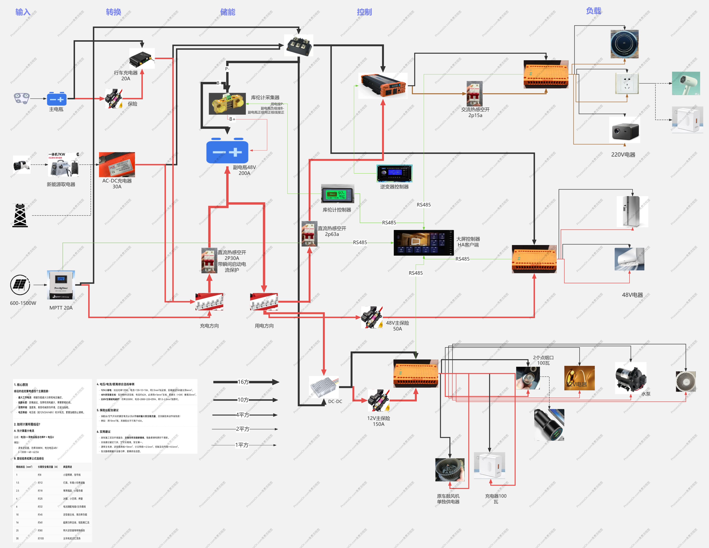

# 设计决策：电力系统与智能化硬件

## 📋 方案概述

本方案规定了房车 48V 电力系统的硬件架构、施工规范及智能化集成方式。核心原则是**"星型配电、源头熔断、模块化隔离"**。

**先看图，再读文**：

| 图 | 看什么 |
|----|--------|
| [power-architecture.svg](./diagrams/power-architecture.svg) | 整车电力单线：电池 → 源头保护 → 中门箱 → 48V/12V/AC 三路负载 + 多源充电 |
| [box-layout.svg](./diagrams/box-layout.svg) | 中门配电箱箱内器件布局（施工时按图定位） |
| 早期手绘总图（存档参考） | [assets/wiring/房车电路.png](./assets/wiring/房车电路.png) |

<figure>

<figcaption>早期手绘整车电路总图（存档参考，新方案以上方 SVG 为准）</figcaption>
</figure>

> **施工请从 [build-guide.md](build-guide.md) 的施工主线开始**，按阶段执行；本文讲"为什么这样设计"。

## 🔌 硬件模块划分

### 1. 电池模块 (Battery Module)
- **核心**: 48V 磷酸铁锂电池组。
- **保护**: 必须具备源头熔断器及主断路器。

### 2. 分电模块 (Distribution Module)
- **输入**: 48V 主电池正负极（上游为源头熔断器 150A + 主断路器 125A，均在电池侧；入箱后再经总开关 + 总保险 60A 双重保护）。
- **输出**: 中门配电箱星型出线 —— 48V 保险盒（动力回路）+ DCDC 降压 → 12V 保险盒（照明/通风/冰箱/控制），详见 [design-distribution-box.md](design-distribution-box.md)。
- **接口防呆**: 48V 用 Anderson SB50（蓝色壳），12V 用 Deutsch DT 系列（黑色壳），尺寸/颜色物理防呆，绝不同系列混用。

### 3. 充电模块 (Charging Module)
- **多源输入**:
  - 行车充电 (DC-DC)。
  - 太阳能充电 (MPPT)。
  - 市电充电器 (58.4V)。
- **MPPT 485 集成**: 易科 MPPT 支持 485 监控与控制（充电开关/限流/待机断电/低温禁充），协议速查与功能规划见 [10-smart-control/energy/mppt-protocol.md](../10-smart-control/energy/mppt-protocol.md)，原始手册 `attachments/MPTT.pdf`。
- **物理接口**: 统一使用安德森接口以便于插拔维护。

### 4. 总控与 AC 模块 (Control & AC Module)
- **AC 220V**:
  - 逆变器输出侧加装两极交流接触器 (25-40A)。
  - 设置红色蘑菇急停按钮，实现硬件级一键切断 AC 输出。
  - 物理分区：盒内强弱电用阻燃隔板完全隔离。
- **总控**: 集成 485 继电器模块、PZEM 电量计、HA 主机。

## 🛠️ 施工规范 (Wiring Standards)

> 术语说明：其他模块文档里的"副电瓶 12V"指本系统 **DCDC 降压输出的 12V 常电母线**（来自 48V 主电池，非独立 12V 电池）。

### 1. 布线原则
- **星型配电**: 所有大电流支路从配电箱独立发出，严禁"串房子"式级联（顺序不可改：电源 → 保险盒 → 继电器 COM → NO → 端子排 → 负载）。
- **垂直分层**:
  - 底层：重型电池与逆变器（降低重心）。
  - 中层：发热设备（风道散热）。
  - 顶层：保险丝与开关面板（易于维护）。
- **管路保护**: 使用 PP 波纹管套线，同一回路正负极同管同行，AC 与 DC 严禁混跑；485 信号线与 12V 负载线间距 ≥15cm，禁止同管。

### 2. 智能控制

控制逻辑、485 总线、双控策略见 [10-smart-control](../10-smart-control/)；面板按键/IO 通道分配与 14 芯线定义见 [switch-assignment.md](switch-assignment.md)（配 [14core-cable.svg](./diagrams/14core-cable.svg) / [485-bus.svg](./diagrams/485-bus.svg) 阅读）。

## 安全与维护

- **标记**: 所有线束与接口必须有清晰标签（两端都贴），并配有接线文档。
- **防震**: 穿孔处必须加装护圈，所有接点使用螺栓紧固并热缩管密封。
- **散热**: 遵循"下进上出"烟囱效应，必要时加装 12V 温控风扇；DCDC 四周 5cm 内无线缆遮挡。
- **通电**: 必须分阶段通电（48V 总进线 → DCDC 输出 → 控制模块 → 灯 → 风扇 → 水泵最后），逐段量电压后再下一步。完整检查清单见 [build-guide.md §5](build-guide.md#_5-分阶段通电) 与 [design-distribution-box.md §十二](design-distribution-box.md#十二、安全检查清单)。
