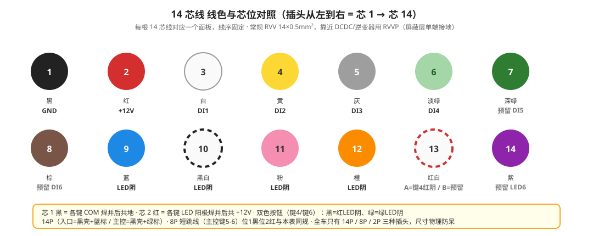
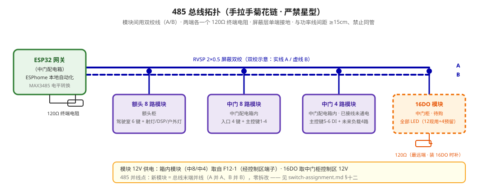

# 面板开关分配 & IO 通道分配

## 按钮规格

- **类型**: 自复位（不带自锁），常开 NO
- **单色 4 线**: 绿绿 = 开关触点（COM/NO），红 = LED 阳极，黑 = LED 阴极
- **双色 5 线**: 黄白 = 开关触点（NO/COM），红 = 共阳（+12V），黑 = 红LED 阴，绿 = 绿LED 阴
- **DI 常态**: 模块内部上拉，静态高电平，按压拉低
- **逻辑**: 短按/长按判定在 ESPhome 里做，按钮本身无状态
- **汇接**: 每面板开关 COM 共 GND、LED 阳极共 +12V，焊并后用端子压接

## 模块清单

| 模块 | 位置 | 通道数 | 阶段 | 干什么 |
|------|------|--------|------|--------|
| **额头-模块** | 额头柜 | **8 路** | 未买 | 切 12V 负载 + 读驾驶室面板按键（后期扩展） |
| **中门-8路** | 中门配电箱内 | 8 DI + 8 DO（10A） | 现在 | **纯负载**（主灯/氛围/排气扇/泵48V/水阀/冰箱/倒车灯+预留）+ 读入口/主控按键 |
| **中门-4路** | 中门配电箱内 | 4 DI + 4 DO（10A） | 现在 | **未来负载扩展 4 路**（现空）+ 读主控键5-6 |
| **中门-16DO** | 中门柜内 | 16 DO（5A，无DI，一个485地址） | **待购** | **全部 LED**（12 现用 + 4 预留） |

> **架构定稿（最终）**：配电箱 DO 全留给负载（稀缺，藏墙不拆），LED 全走中门柜的 16路 DO。
> - **车尾不设模块**：倒车灯负载并进中8，电源从中门拉线到车尾。
> - **上水泵 48V 直接 Y 切**（几十瓦感性，续流二极管 1N5408，不上接触器）。
> - **每个开关配一颗 LED**，全部走中门 16DO（5A，一个485地址，ESPhome 一个设备）。
> - **配电箱只有 4+8 空间，DO 全给负载**：中8(7负载+1预留) + 中4(4路未来负载)。
> - 不上位机，ESPhome 在 ESP32 本地跑自动化。后期加 HA 只做 dashboard/远程/通知，**不承载安全关键自动化**（角色边界见 [10-smart-control/n100-ha/design.md](../10-smart-control/n100-ha/design.md)）。

**通道编号规则**：

| 写在表里的 | 意思 |
|-----------|------|
| `额头.R1` | 额头模块第 1 路继电器 |
| `额头.DI1` | 额头模块第 1 路数字量输入 |
| `中8.R1` | 中门 8 路模块第 1 路继电器 |
| `中8.DI1` | 中门 8 路模块第 1 路数字量输入 |
| `中4.R1` | 中门 4 路模块第 1 路继电器 |
| `16DO.R1` | 中门 16 路 DO 模块第 1 路继电器（待购） |

> **模块丝印对照**：中8 模块实物端子按 PLC 习惯标 **X/Y**——**X1-X8 = 数字量输入**（即本文 DI1-8），**Y1-Y8 = 继电器输出**（即本文 R1-R8）。接线/排查按丝印找端子，按本文名称对逻辑：如 中8.R1 = 丝印 **Y1**、中8.DI1 = 丝印 **X1**。每个 Y 是继电器干接点，**COM = 公共端（进电侧）**，**NO = 常开出线到负载**，**NC = 常闭（本设计不用，一律空着）**。每个 Y 有三口：NO / COM / NC。

---

## LED 策略

**每个开关都配一颗 LED 状态指示**（远程+本地双控下，没 LED 根本不知道设备开没开）。

LED 全部走**中门 16DO 模块**（16 路 DO，5A，一个 485 地址）——ESPhome 软件把「负载 DO 动作」与「LED DO 动作」绑成同步：负载 Y 吸合时，软件同时驱动对应的 LED Y 吸合，灯亮 = 设备开。**LED 全集中在一个设备里，ESPhome 配一个 16 路开关实体，最简洁。**

> **场景键降单色**：离车/驻车、灯光模式这 2 个场景键的 LED 用**单色**（亮=进入模式，灭=正常），不用双色红绿——这样 12 个按钮 = 12 路 LED，16DO 用 12 留 4。

**接线（独立 Y 驱动 LED）**：

```
LED 阳极（共阳，红线）→ +12V 控+
LED 阴极 ── 电阻(裸LED串1-3.3kΩ) ──→ 16DO 对应 Y 的 COM
16DO 对应 Y 的 NO ──→ 模块 GND
```

> 即：独立 Y 的 COM/NO 当"吸地开关"用，Y 吸合 → LED 阴极经触点回 GND → 灯亮。LED 与负载继电器彻底分离：负载在中8/中4（配电箱），LED 全在 16DO（中门柜）。

**LED 分配（全走 16DO，12 现用 + 4 预留）**：

| LED | 16DO 的 Y | 跟踪 |
|-----|----------|------|
| 入口键1 排水 LED | Y1 | 中8.Y5 水阀 |
| 入口键2 户外灯 LED | Y2 | 额头.R2 |
| 入口键3 上水泵 LED | Y3 | 中8.Y4 泵（与主控键4 共用） |
| 入口键4 离车/驻车 LED（单色） | Y4 | 场景：亮=已进入模式 |
| 主控键1 主灯 LED | Y5 | 中8.Y1 |
| 主控键2 氛围 LED | Y6 | 中8.Y2 |
| 主控键3 排气扇 LED | Y7 | 中8.Y3 |
| 主控键4 上水泵 LED | Y8 | 中8.Y4（与入口键3 共用） |
| 主控键5 冰箱 LED | Y9 | 中8.Y6 |
| 主控键6 灯光模式 LED（单色） | Y10 | 场景：亮=场景激活 |
| 车尾扩展1 LED | Y11 | 未来负载 |
| 车尾扩展2 LED | Y12 | 未来负载 |
| 预留 | Y13-Y16 | 未来加按钮 |

> **双控泵 LED**：入口键3 与主控键4 都控 中8.Y4，两颗按钮各有一颗 LED（16DO.Y3 + 16DO.Y8），ESPhome 让它们一起亮灭。
> 裸 LED 每色串 1-3.3kΩ；双色灯若后期改回，每色占一个独立 Y（16DO 有多余 4 路可用）。

---

## 一、驾驶室面板（额头柜，6 键 + 2 预留）

面板 → 14 芯线 → 额头模块。

| 键 | 功能 | 按钮输入 | 负载继电器 | 备注 |
|----|------|----------|-----------|------|
| 1 | 射灯(前) | 额头.DI1 | 额头.R1 | |
| 2 | 倒车灯 | 额头.DI2 | 中8.Y7 | 纯手动，不联动倒挡；车尾灯并进中门，ESPhome 跨模块 |
| 3 | DSP | 额头.DI3 | 额头.R3 | 含低音炮 |
| 4 | 换气风扇 | 额头.DI4 | 无 (蓝牙) | 后期解析协议 |
| 5 | 预留 | 额头.DI5 | — | |
| 6 | 灯光模式 | 额头.DI6 | 无 | ESPhome 场景：明亮→夜灯→全关 |
| — | 预留 | 额头.DI7-8 | — | 后期扩展 |

---

## 二、中门入口面板（4 键）

面板 → 14芯A → 中门 8 路模块。

| 键 | 功能 | 按钮输入 | 负载继电器 | LED（16DO） | 备注 |
|----|------|----------|-----------|------------|------|
| 1 | 排水 | 中8.DI1 | 中8.Y5（水阀） | 16DO.Y1 | 常闭型 12V 球阀，通电开/断电关 |
| 2 | 户外灯 | 中8.DI2 | 额头.R2 | 16DO.Y2 | 负载在额头柜；ESPhome 跨模块联动 |
| 3 | 上水泵 | 中8.DI3 | 中8.Y4（泵48V） | 16DO.Y3 | 48V 直切，续流二极管；双控：主控键4 |
| 4 | 离车/驻车 | 中8.DI4 | 无 | 16DO.Y4（单色） | ESPhome 场景：离车→驻车→正常；亮=进入模式 |

> **键4 当前实装单色**：单色按钮 LED 黑线 → 芯12 → 16DO.Y4（离车驻车LED），触点线和共阳不动。

> **离车模式**: 主灯、氛围灯/睡眠灯、户外灯、射灯、倒车灯、排气扇、换气风扇、上水泵、电控水阀、DSP 全关。冰箱和 MPPT 不断电。
> **驻车模式**: 预设场景（主灯暖光、氛围灯亮、逆变器通电、PIR 感应启用等）。

---

## 三、中门主控面板（靠后床，6 键）

面板出两路线：键1-4 → 14芯B → 中门8路（配电箱），键5-6 → 8P短线 → 中门4路（中门柜内）。

> **物理排位**：键1（主灯）与键6（灯光模式）互换位置——双色按钮装原键1 位，主灯按钮装原键6 位。接线不变，仍按功能对号：双色按钮 5 线 → 8P 端子 + COM②/阳极②；主灯按钮 4 线 → 14芯B 芯3/9 + COM①/阳极①。按钮引线不够长时面板内加延长线。

| 键 | 功能 | 按钮输入 | 负载继电器 | LED（16DO） | 备注 |
|----|------|----------|-----------|------------|------|
| 1 | 主灯 | 中8.DI5 | 中8.Y1 | 16DO.Y5 | 短按主灯开/关；长按2s灯光全关；灯带物理开关+2.4G遥控 |
| 2 | 氛围灯/睡眠灯 | 中8.DI6 | 中8.Y2 | 16DO.Y6 | 同一继电器；端子排5-8位并出线；睡眠灯床头独立开关 |
| 3 | 排气扇场景 | 中8.DI7 | 中8.Y3 + 额头.R4 | 16DO.Y7 | 4小风扇；循环：全关→仅后窗→后窗+副驾→全开 |
| 4 | 上水泵 | 中8.DI8 | 中8.Y4 | 16DO.Y8 | 双控：入口键3；48V直切+续流二极管 |
| 5 | 冰箱 | 中4.DI1 | 中8.Y6 | 16DO.Y9 | ESPhome 跟踪 Y6 状态驱动 LED；离车自动关 |
| 6 | 灯光模式 | 中4.DI2 | 无 | 16DO.Y10（单色） | 明亮→夜灯→全关；亮=场景激活 |

> **键4（上水泵）双控 LED 同步**：入口键3 与主控键4 都控 中8.Y4，两颗按钮的 LED 分别进 16DO.Y3 和 16DO.Y8，ESPhome 让它们一起亮灭。

> **主灯和睡眠灯双控逻辑**：485 继电器（Y1/Y2）管总电源，灯上物理开关/遥控管本地控制。两者串联——继电器断电=灯必灭，通电=灯由本地开关决定。键1 长按 2s = ESPhome 同时断 Y1+Y2。

---

## 四、继电器通道分配

### 额头模块（8 路）

| 通道 | 负载 | 控制方式 |
|------|------|---------|
| R1 | 车顶前射灯 ×2 | 驾驶室键1 |
| R2 | 户外侧灯 | 入口键2（ESPhome 跨模块） |
| R3 | DSP + 低音炮 | 驾驶室键3 |
| R4 | 副驾窗排气扇 | 主控键3（排气扇场景联动） |
| R5 | —（LED DO） | 入口键2 LED（跨箱线，预留） |
| R6 | MPPT 待机断电接触器线圈（备选硬件档） | ESPhome 自动化，见 [energy/mppt-protocol.md](../10-smart-control/energy/mppt-protocol.md) |
| R7-8 | 预留 | 后期扩展 |

### 中门 8 路模块（配电箱内 · 纯负载）

| 通道 | 负载 | 控制方式 |
|------|------|---------|
| Y1 | 主灯 | 主控键1 |
| Y2 | 氛围灯 + 睡眠灯 | 主控键2 |
| Y3 | 后窗排气扇（4 小风扇） | 主控键3（排气扇场景联动） |
| Y4 | 上水泵（48V 直切 + 续流二极管） | 入口键3 + 主控键4（双控） |
| Y5 | 电控水阀（排水） | 入口键1（常闭型，通电开/断电关） |
| Y6 | 冰箱 | 主控键5 / ESPhome 自动化 |
| Y7 | 倒车灯（车尾并进） | 驾驶室键2（ESPhome 跨模块，纯手动不联动倒挡） |
| Y8 | 预留 | 未来扩展负载 |

> 中8 = **纯负载模块**，8 路全切功率，不塞 LED（LED 全走中门 16DO）。倒车灯从车尾并进，电源从中8.Y7 拉线到车尾。

### 中门 4 路模块（配电箱内 · 未来负载扩展）

| 通道 | 用途 | 备注 |
|------|------|------|
| Y1 | 未来负载 1 | 现空 |
| Y2 | 未来负载 2 | 现空 |
| Y3 | 未来负载 3 | 现空 |
| Y4 | 未来负载 4 | 现空 |
| DI1 | 主控键5（冰箱） | 短按切换冰箱 |
| DI2 | 主控键6（灯光模式） | 短按循环场景 |
| DI3-4 | 预留 | 未来分散独立按钮 |

> 中4 = **未来负载扩展**（4 路 DO 空着，等以后加负载）+ 读键5-6。配电箱 DO 全留给负载（稀缺资源，藏墙不拆）。

### 中门 16DO 模块（中门柜内 · 全部 LED）

| 通道 | 用途 | 备注 |
|------|------|------|
| Y1 | 入口键1 排水 LED | 跟踪 中8.Y5 |
| Y2 | 入口键2 户外灯 LED | 跟踪 额头.R2 |
| Y3 | 入口键3 上水泵 LED | 跟踪 中8.Y4 |
| Y4 | 入口键4 离车/驻车 LED（单色） | ESPhome 场景 |
| Y5 | 主控键1 主灯 LED | 跟踪 中8.Y1 |
| Y6 | 主控键2 氛围 LED | 跟踪 中8.Y2 |
| Y7 | 主控键3 排气扇 LED | 跟踪 中8.Y3 |
| Y8 | 主控键4 上水泵 LED | 跟踪 中8.Y4 |
| Y9 | 主控键5 冰箱 LED | 跟踪 中8.Y6 |
| Y10 | 主控键6 灯光模式 LED（单色） | ESPhome 场景 |
| Y11 | 车尾扩展1 LED | 未来负载 |
| Y12 | 车尾扩展2 LED | 未来负载 |
| Y13-16 | 预留 | 未来加按钮 |

> 16DO = **全部 LED 的唯一模块**（16 路 DO，5A，一个 485 地址，ESPhome 一个设备）。只走 LED 小电流，绝不接大功率负载。

> **当前状态**: 16DO 待购。中8 已接（负载+DI）；中4 已接线未通电（DI 键5-6 接好，DO 空）。额头模块未买。

---

## 五、DI 通道占用总览

### 额头模块（8 DI）

| 通道 | 接哪颗按钮 |
|------|-----------|
| DI1 | 驾驶室 射灯 |
| DI2 | 驾驶室 倒车灯 |
| DI3 | 驾驶室 DSP |
| DI4 | 驾驶室 换气风扇 |
| DI5 | 驾驶室 预留 |
| DI6 | 驾驶室 灯光模式 |
| DI7-8 | 预留 |

### 中门 8 路模块（8 DI）

| 通道 | 接哪颗按钮 |
|------|-----------|
| DI1 | 入口 排水 |
| DI2 | 入口 户外灯 |
| DI3 | 入口 上水泵 |
| DI4 | 入口 离车/驻车 |
| DI5 | 主控 主灯 |
| DI6 | 主控 氛围灯/睡眠灯 |
| DI7 | 主控 排气扇场景 |
| DI8 | 主控 上水泵 |

### 中门 4 路模块（4 DI）

| 通道 | 接哪颗按钮 |
|------|-----------|
| DI1 | 主控键5 冰箱 |
| DI2 | 主控键6 灯光模式 |
| DI3-4 | 预留（未来分散独立按钮） |

### 扩展预留（未来分散独立按钮）

计划后期在车内各处（床头、储物仓、户外等）加独立按钮。预留通道：

| 预留位置 | 通道 | 说明 |
|---------|------|------|
| 中4 DI3-4 | 2 个 | 优先用，最近 |
| 额头 DI5/D17-8 | 3 个 | 驾驶室侧扩展 |
| 16DO Y13-16（LED） | 4 个 | 未来按钮的 LED |
| 485 总线再挂模块 | 无限 | 零拆改，见 §十二 |

> 扩展原则：按钮走 **DI（输入）**、对应 LED 走 **DO（LED模块）**、负载走 **负载模块 DO**。加新按钮 = 在预留 DI 上接一根线 + ESPhome 配置，**永远不动现有负载接线**。

---

## 六、12V 保险分配

### 中门 12V 保险盒（12 路箱，现用 6 路，余 6 路预留）

| 保险位 | 负载 | 电流 | 合并逻辑 |
|--------|------|------|----------|
| F12-1 | 控制系统 + 485 + 电控水阀 + 车内锁 + 踏步 | 10A | 全控制级小电流 |
| F12-2 | 主灯 + 氛围灯 + 睡眠灯 | 10A | 灯全合，进模块时 COM 分线 |
| F12-3 | 后窗排气扇（4 小风扇） | 5A | 低功率，独立 |
| F12-4 | 冰箱 | 10A | 压缩机启动电流大，独立 |
| F12-5 | 点烟器 1 | 15A | 二排座椅后 |
| F12-6 | 点烟器 2 | 15A | 中门柜|

> F12-2 出一根 1.5mm² → 到模块处分叉 → R1.COM + R2.COM。继电器 COM 端不受保险保护的那段极短（几 cm），安全。

### 倒车灯供电（并进中门，不再设车尾模块）

倒车灯负载由 中8.Y7 切（中门出线拉到车尾）。保险 F12-6 或单独一分路给倒车灯（5A 独立）。车尾不再设独立保险盒/模块。

| 项目 | 值 |
|------|-----|
| 倒车灯 | 中8.Y7 → 拉线到车尾，5A 保险 |
| 车尾其他设备 | 未来加则从倒车灯同一路或点烟器取，或 485 总线再挂模块 |

---

## 七、14 芯线缆定义



线色（插头从左到右）：黑 / 红 / 白 / 黄 / 灰 / 淡绿 / 深绿 / 棕 / 蓝 / 黑白 / 粉 / 橙 / 红白 / 紫

> **LED 接法已更新（最终定稿）**：下方表中 LED 阴"接中8.OUTx / 中4.OUTx"的旧写法，现统一改为 —— LED 阴 → 中门 16DO 模块的 Y（Y1-Y12），ESPhome 软件绑同步。线芯定义（哪根芯是哪个 LED 阴）不变，只改"接到 16DO 的哪个 Y"。对照见本文件「LED 策略」章。

### 14芯A — 入口面板 → 中门 8 路

| 芯 | 色 | 信号 | 接 |
|----|-----|------|-----|
| 1 | 黑 | GND（键1-3 绿COM + 键4 白COM） | 中8 GND（与电源负焊并 3→1） |
| 2 | 红 | +12V（键1-3 红 + 键4 红共阳） | 中8 VCC（与电源正焊并 3→1） |
| 3 | 白 | 键1 NO（排水） | 中8.DI1 |
| 4 | 黄 | 键2 NO（户外灯） | 中8.DI2 |
| 5 | 灰 | 键3 NO（上水泵） | 中8.DI3 |
| 6 | 淡绿 | 键4 NO（离车/驻车） | 中8.DI4 |
| 7 | 深绿 | 预留（DI5） | — |
| 8 | 棕 | 预留（DI6） | — |
| 9 | 蓝 | 键1 LED 阴极 | 16DO.Y1（排水LED） |
| 10 | 黑白 | 键2 LED 阴极 | 16DO.Y2（户外灯LED） |
| 11 | 粉 | 键3 LED 阴极 | 16DO.Y3（泵LED） |
| 12 | 橙 | 键4 LED 阴极（单色） | 16DO.Y4（离车驻车LED） |
| 13 | 红白 | 预留 | — |
| 14 | 紫 | 预留 | — |

### 14芯B — 主控面板 → 中门 8 路

| 芯 | 色 | 信号 | 接 |
|----|-----|------|-----|
| 1 | 黑 | GND（键1-4 COM） | 中8 GND（与电源负焊并 3→1） |
| 2 | 红 | +12V（键1-4 LED 阳极共接） | 中8 VCC（与电源正焊并 3→1） |
| 3 | 白 | 键1 NO（主灯） | 中8.DI5 |
| 4 | 黄 | 键2 NO（氛围灯/睡眠灯） | 中8.DI6 |
| 5 | 灰 | 键3 NO（排气扇场景） | 中8.DI7 |
| 6 | 淡绿 | 键4 NO（上水泵） | 中8.DI8 |
| 7 | 深绿 | 预留（DI5） | — |
| 8 | 棕 | 预留（DI6） | — |
| 9 | 蓝 | 键1 LED 阴极 | 16DO.Y5（主灯LED） |
| 10 | 黑白 | 键2 LED 阴极 | 16DO.Y6（氛围LED） |
| 11 | 粉 | 键3 LED 阴极 | 16DO.Y7（排气扇LED） |
| 12 | 橙 | 键4 LED 阴极 | 16DO.Y8（泵LED） |
| 13 | 红白 | 预留 | — |
| 14 | 紫 | 预留 | — |

> **双控泵 LED（不再汇接）**：入口键3（14芯A 芯11粉）→ 16DO.Y3，主控键4（14芯B 芯12橙）→ 16DO.Y8。两颗按钮各一颗 LED，ESPhome 软件让它们一起亮灭，物理上**不并线**。

### 短跳线 — 主控面板键5-6 → 中门 4 路

中门柜内短跳线一根 8P，长度约 30-50cm。位1 黑、位2 红与 14P 同规（黑=GND、红=+12V）。

| 位 | 色 | 信号 | 接 |
|----|-----|------|-----|
| 1 | 黑 | GND（键5绿COM + 键6白COM 焊并） | 中4.GND |
| 2 | 红 | +12V（键5红 + 键6红共阳 焊并） | 中4 12V |
| 3 | 白 | 键5 绿NO（冰箱） | 中4.DI1 |
| 4 | 黄 | 键6 黄NO（灯光模式） | 中4.DI2 |
| 5 | 灰 | 键5 LED 阴极 | 16DO.Y9（冰箱LED） |
| 6 | 棕 | 键6 LED 阴极 | 16DO.Y10（灯光模式LED，单色） |
| 7 | 绿 | 备用（键6 已降单色，双色时用） | — |
| 8 | 蓝 | 备用 | — |

> 全车插头只保留 14P/8P/2P 三种尺寸，且 8P 仅此一根，不存在插错可能。

### 面板侧接线（按钮线 → 线芯）

单色按钮两绿线不分极性（COM/NO 任意互换），双色按钮黄/白不分极性。除 COM 和阳极焊并外，每根按钮线独立压入面板上 EDK 插座的对应端子。

> 每个按键的 3 个回路（开关检测 / LED 指示 / 负载功率）与"两个 COM"辨析见 [button-wiring.svg](./diagrams/button-wiring.svg)。

**入口面板（3 单色 + 1 双色）→ 14芯A**：

| 按钮 | 触点线 | LED 线 |
|------|--------|--------|
| 键1 单色 | 绿→芯3 / 绿→COM焊并 | 红→阳极焊并 / 黑→芯9（预留） |
| 键2 单色 | 绿→芯4 / 绿→COM焊并 | 红→阳极焊并 / 黑→芯10（预留，跨额头） |
| 键3 单色 | 绿→芯5 / 绿→COM焊并 | 红→阳极焊并 / 黑→芯11（预留） |
| 键4 双色（现单色） | 黄→芯6 / 白→COM焊并 | 红→阳极焊并 / 绿→芯12（绿LED·驻车） / 黑→芯13（红LED·离车，现空压） |

焊并点 2 个：

| 点 | 并线 | 去向 |
|----|------|------|
| COM | 键1-3 绿 + 键4 白 | 芯1 黑（GND） |
| 阳极 | 键1-3 红 + 键4 红 | 芯2 红（+12V） |

**主控面板（5 单色 + 1 双色）**：键1-4 → 14芯B，键5-6 → 8P短线。键1 与键6 物理换位（双色按钮在原键1 位），接线仍按本表对号。

| 按钮 | 触点线 | LED 线 |
|------|--------|--------|
| 键1 单色 | 绿→芯3 / 绿→COM焊并① | 红→阳极焊并① / 黑→芯9 |
| 键2 单色 | 绿→芯4 / 绿→COM焊并① | 红→阳极焊并① / 黑→芯10 |
| 键3 单色 | 绿→芯5 / 绿→COM焊并① | 红→阳极焊并① / 黑→芯11 |
| 键4 单色 | 绿→芯6 / 绿→COM焊并① | 红→阳极焊并① / 黑→芯12 |
| 键5 单色 | 绿→8P-3 / 绿→COM焊并② | 红→阳极焊并② / 黑→8P-5 |
| 键6 双色 | 黄→8P-4 / 白→COM焊并② | 红→阳极焊并② / 黑→8P-6（红LED·夜灯） / 绿→8P-7（绿LED·明亮） |

焊并点 4 个：

| 点 | 并线 | 去向 |
|----|------|------|
| COM① | 键1-4 绿（4 根） | 芯1 黑（GND） |
| 阳极① | 键1-4 红（4 根） | 芯2 红（+12V） |
| COM② | 键5 绿 + 键6 白 | 8P 位1 |
| 阳极② | 键5 红 + 键6 红 | 8P 位2 |

> 焊并做法：几根线拧在一起焊锡 + 热缩管，再单线压入 EDK 插座端子。入口键1-3 LED 芯在箱内预留到端子排，面板侧已全部接好。键4 现为单色：LED 黑线接芯12，芯13 空压备用；换双色后 绿→芯12、黑→芯13，其余线不动。

---

## 八、中门配电箱端子排布局


### 功率正极区（红色，独立，不桥接）

| 位 | 负载 | 来自 |
|----|------|------|
| 1 | 点烟器1+ | F12-5 直连（不经继电器） |
| 2 | 点烟器2+ | F12-6 直连（不经继电器） |
| 3 | 冰箱+ | 中8.R8.NO |
| 4 | 主灯+ | 中8.R1.NO |
| 5-8 | 氛围灯/睡眠灯+ | 中8.R2.NO，4 位并联供电，各路独立出线 |
| 9 | 后窗排气扇+ | 中8.R4.NO |
| 10 | 电控水阀+ | 中8.R7.NO |
| 11-12 | 预留 | — |

### 功率负极区（黑色，短接片全桥接）

| 位 | 负载 |
|----|------|
| 13 | 点烟器1- |
| 14 | 点烟器2- |
| 15 | 冰箱- |
| 16 | 主灯- |
| 17 | 氛围灯- |
| 18 | 睡眠灯- |
| 19 | 后窗排气扇- |
| 20 | 电控水阀- |
| 21-22 | 预留 |

> 位 13-22 短接片全桥接 → 6mm² 黑线到电池总负。

### 控制区（红/黑，独立隔板分隔）

| 端子 | 用途 |
|------|------|
| 控+ | 12V 控制电源（F12-1 → 2A 保险） |
| 控- | → 负极区 |
| 中8 12V | 8 路模块供电 |
| 中8 GND | 8 路模块地 |
| 中4 12V | 中门 4 路模块供电（已接线，保险未插） |
| 中4 GND | 中门 4 路模块地（已接线） |
| 485-A/B | 485 总线并线（中4 已接，车尾预留） |

### 施工顺序：在家预制，车里只接端子排

负载线都是「模块/保险 → 端子排 → 负载」，端子排是固定汇接中心，负载位置固定，线长可提前确定。

**在家做**：

1. 按上表量各负载线长（留 5-10cm 余量），裁线、剥线、压冷压端子（线鼻子）并压紧
2. 该并的先并好，套热缩管 + 贴标签：
   - 氛围灯/睡眠灯 4 路：中8.R2.NO 并 4 路出线（位5-8）
   - R1/R2 COM 分叉：F12-2 的 1.5mm² 分叉到 R1.COM + R2.COM
   - 负极全桥（位13-22）：端子排自带短接片，不用自己并
   - 双控泵 LED：入口键3（芯11粉）→ 16DO.Y3、主控键4（芯12橙）→ 16DO.Y8（各一颗，不并线）
3. 每个负载 2P 正负各一芯，正进红色区对应位、负进黑色桥

**到车里做**：

1. 每根线插进端子排对应位、拧螺丝
2. 万用表逐负载位量 12V、量短路（上电前）
3. 核对无误再插保险上电

---

## 九、导轨分区色标

同一条 DIN 导轨，不同电压/功能用端子颜色区分：

| 区域 | 颜色 | 内容 |
|------|------|------|
| 功率正极 | **红色** | 12V 负载出线（位 1-12）+ 控制区 12V |
| 功率负极 | **黑色** | 全桥接汇流（位 13-22）+ 控制区 GND |
| 蓝色 | 备用 | 后期扩展用 |
| 各区间 | **UK 隔板** | 物理隔离 |

---

## 十、485 总线拓扑



```
ESP32（中门配电箱）
  ├── 额头模块（额头柜，8路，未买）
  ├── 中8 模块（配电箱内，纯负载）
  ├── 中4 模块（配电箱内，未来负载扩展）
  └── 16DO 模块（中门柜，全 LED，待购）
```

手拉手菊花链，模块间用双绞线（A/B）。终端电阻在 ESP32 和最远端模块各一个 120Ω。

## 十一、线缆接头规划

| 线缆 | 从 → 到 | 接头 | 说明 |
|------|---------|------|------|
| 14芯B | 主控面板键1-4 → 中8 | **14P** | 位1 GND、位2 12V、位3-6 NO、位7-8 预留DI、位9-12 LED-、位13-14 预留LED |
| 14芯A | 入口面板 → 中8 | **14P** | 位1 GND、位2 12V、位3-6 NO、位7-8 预留DI、位9-11 LED-、位12 键4绿阴、位13 键4红阴、位14 预留LED；LED 芯现在空压，后期面板侧接灯即用 |
| 短线 | 主控面板键5-6 → 中4 | **8P** | 位1 GND、位2 12V、位3-4 NO、位5-7 LED-、位8 备用 |
| 驾驶室面板 | → 额头模块 | 直接接线 | 同在额头柜，走线不设接头 |
| 各负载出线 | 端子排 → 负载 | **2P**（每负载 1 对） | 正负各一芯，替代 Deutsch DT 方案 |

> 插座装在面板上，按钮线直接压入螺丝端子；线缆端压插头，面板整体可拔插。焊锡汇接仅两处：绿 COM 并 1、红 LED+ 并 1。14P/8P/2P 尺寸不同，物理防呆。

## 十二、后期扩展路径（零拆改）

**中4 通电**：插保险 → ESPhome 加模块配置 → 键5-6 DI 即时可用，4 路 DO 留给未来负载。无需摸线。

**加 16DO 模块**：新导轨一条 → 485 从总线并线（菊花链）→ 12V 从控制区取 → 全部 LED 接这里（一个485地址，一个设备）。零拆改现有负载。

**车尾灯（并进中门）**：中8.Y7 → 拉一对线到车尾灯，负极回中门负排。驾驶室键2 走 ESPhome 跨模块驱动，不改物理接线。

**加未来负载**：中8.Y8（余1）+ 中4.Y1-4（余4）= 5 个负载扩展位，都在配电箱（DO 已预留）。接保险+继电器+端子，ESPhome 配置即可。

**加分散独立按钮**：DI 接 中4 DI3-4 / 额头 DI 空闲位；LED 接 16DO 的 Y13-16（余4）。负载走负载模块，LED 走 16DO。
