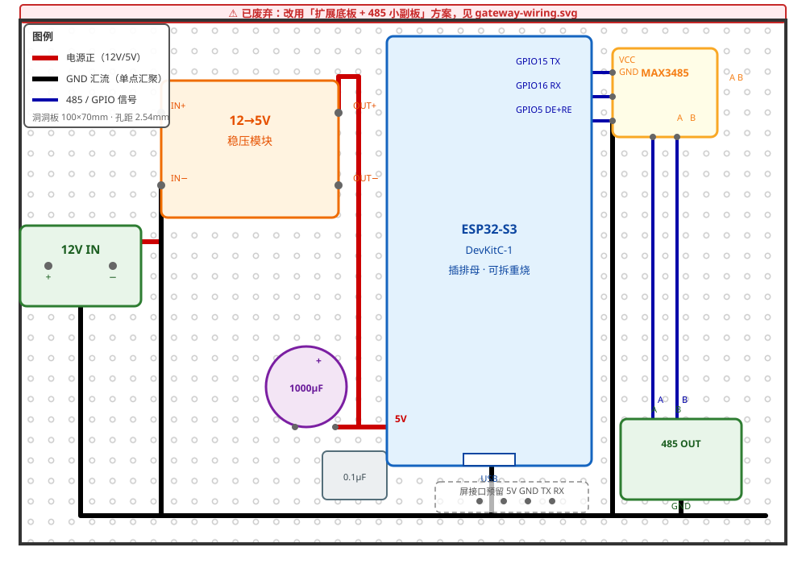

# 施工指导：ESP32-S3 485 网关（面包板 → 上车）

> **安全提醒**：12V 模块接线前先断电再动手；485 模块 12V 供电正负极严禁接反；上车阶段插保险前先用万用表确认电压。

MAX3485 是 3.3V 收发器，与 ESP32-S3 电平完全匹配——RO/DI 全部直连，不需要任何分压电阻（这是选它而不是 MAX485 的原因）。

## 阶段 0：准备

### 工具

| 工具 | 用途 |
|------|------|
| 万用表 | 电压/通断/电阻（量 A-B 间 120Ω） |
| 面包板 + 杜邦线 | 原型验证 |
| USB 数据线 | S3 烧录/日志（要数据线，不能是纯充电线） |
| 电脑（已装 esphome CLI） | 烧录 + 看日志 |
| 手机 | 连 my-van 热点按 web 按钮 |
| 12V 电源（适配器或可调电源，≥2A） | 给 485 继电器模块供电（桌面联调） |
| USB-485 转换器（CH340/FT232） | 外部对端联调（推荐） |
| 电烙铁 + 焊锡 + 热缩管 + 热风枪/打火机 | 组装焊接 |
| 压线钳 + 螺丝端子 | 组装上车 |

### 物料

| 名称 | 规格 | 数量 | 用途 | 状态 |
|------|------|------|------|------|
| ESP32-S3 开发板 | DevKitC-1 | 1 | 485 网关，运行 ESPHome | 已有 |
| MAX3485 TTL→485 模块 | 3.3V，带 DE/RE 引脚 | 1 | 信号转换 | 已有 |
| 485 继电器模块 | 见 relays/ 模块清单 | 1 台桌面联调 | 联调对象 | 已有 |
| 12V/24V→5V 稳压模块 | 3A | 1 | 车载供电 | 待购 |
| 电解电容 1000μF 25V + 瓷片电容 0.1μF | 各 2 | 5V 电源滤波 | 待购 |
| 终端电阻 120Ω 0.5W | 2 | 总线首尾匹配 | 待购 |
| RVSP 2×0.5mm² 屏蔽双绞线 | 按走线长度 | 485 总线 | 待购 |
| 洞洞板 | 1 | 焊接载体 | 待购 |
| ABS 防水盒 | 1 | 封装 | 待购 |

## 阶段 1：面包板接线

### 1.1 引脚对应（按 test-485-connect.yaml 定义）

| ESP32-S3 DevKitC-1 | MAX3485 模块 | 说明 |
|--------------------|--------------|------|
| GPIO15 (TX) | DI | 发送 |
| GPIO16 (RX) | RO | 接收（3.3V 直连） |
| GPIO5 | DE + RE（两根并接） | 高=发送、低=接收 |
| 3V3 | VCC | **接 3V3，严禁接 5V** |
| GND | GND | 共地 |

DE 和 RE 用杜邦线短接后一起到 GPIO5（有的模块板上已并好）。逻辑：GPIO5 高电平 = 发送，低电平 = 接收，由固件自动切换。

> **模块丝印对照**（芯片引脚名 vs 成品板常见丝印）：RO = **RXD**、DI = **TXD**、DE/RE 合并脚 = **EN**（高=发送、低=接收）。板子只有 VCC/GND/RXD/TXD/EN/A/B 六个功能脚时，按此对照接线。

### 1.2 接线图

```
ESP32-S3 DevKitC-1                  MAX3485 模块 #1
┌────────────────┐                 ┌──────────────┐
│ 3V3            │─────────────────│ VCC          │
│ GND            │─────────────────│ GND          │
│ GPIO15 (TX)    │─────────────────│ DI           │
│ GPIO16 (RX)    │─────────────────│ RO           │
│ GPIO5          │──────────┬──────│ DE           │
│                │          └──────│ RE           │
│                │                 │ A ──→ 总线 A │
│                │                 │ B ──→ 总线 B │
└────────────────┘                 └──────────────┘
```

S3 由 USB 供电即可，MAX3485 从 S3 的 3V3 引脚取电（模块耗电 <1mA，无压力）。

### 1.3 通电前检查（万用表）

- 3V3 ↔ GND 之间电阻 >10kΩ（无短路）
- DE 与 RE 之间导通
- 插 USB 后测 3V3 引脚 = 3.2~3.4V

## 阶段 2：首次烧录

```bash
cd modules/10-smart-control/gateway/esphome
esphome run test-485-connect.yaml
```

- **第一次烧录**：按住 S3 板上 BOOT 键不放 → 插 USB → 松开 → 执行 run。之后重烧一般自动处理，无需再按
- 烧完看日志：`esphome logs test-485-connect.yaml`（S3 原生 USB 口就是日志口）
- 注意：S3 的 USB 是 GPIO19/20 原生口，板上丝印 UART0（GPIO43/44）与它无关，别接

**验证烧录成功**：日志出现启动信息 + web_server 就绪。wifi 占位符（ooxx）连不上会自动开热点：

- 手机连 WiFi **my-van**（密码 12345678）
- 浏览器打开 **http://192.168.4.1**
- 应看到页面和「485测试发送」按钮

> test-485-connect.yaml 已带 web_server 组件，自带 OTA 功能——装车后不用再插 USB，手机连热点即可无线刷固件。

## 阶段 3：面包板自测（三步走）

### 3.1 TTL 回环——验证 S3 的 UART 本身

- 拔掉 MAX3485 的 DI/RO 两根杜邦线（模块先不参与）
- 用一根杜邦线把 GPIO15 ↔ GPIO16 直接短接
- 手机 web 页按「485测试发送」→ 电脑日志应出现：

```
✅ 收到 8 个字节：01 03 00 00 00 01 84 0A
```

- 通过 = S3 串口、ESPhome 固件、web 按钮、脚本逻辑全部正常

### 3.2 双 MAX3485 回环——验证 485 收发 + DE/RE 切换

> **需要第二块 MAX3485 当对端**。只有一块模块的话跳过 3.2，直接进 3.3（USB-485 转换器已购）或阶段 4 用真实 485 继电器模块当对端——效果一样且更真实。

第二块 MAX3485 当「对端」：

| #2 引脚 | 接 | 说明 |
|---------|-----|------|
| VCC / GND | 3V3 / GND | 供电 |
| DE、RE | 都接 GND | 恒接收 |
| RO | GPIO16 | #1 的 RO 此时**悬空**，两根 RO 不能同时上 RX |
| A / B | 与 #1 的 A/B 并联 | A-A、B-B |

按按钮 → 日志应收到自己发出的 8 字节（S3 → #1 → 总线 → #2 → S3）。

验证的是：TX、#1 的 DI/DE/RE 切换、总线差分传输、#2 的 RO、RX。若收到 **多于 8 字节** 的乱字节，说明 #2 模块无 A/B 偏置电阻，总线悬空时 RO 在输出噪声——不影响结论（前 8 字节正确即通过），后续接真实设备无此问题。

### 3.3 USB-485 联测——验证与真实设备互通

- #1 恢复最终接法：RO→GPIO16（拆掉 #2 的 RO），#2 移除
- USB-485 转换器插电脑，A/B 并到面包板总线，**两端 GND 共地**
- 电脑串口助手（38400 8N1）：

| 方向 | 操作 | 预期 |
|------|------|------|
| 发送 | S3 按 web 按钮 | 电脑收到 `01 03 00 00 00 01 84 0A` |
| 接收 | 电脑发送 `01 03 00 00 00 01 84 0A` | S3 日志收到 8 字节 |

两步都过，面包板阶段完成，接线定稿。

> 为什么三步：单模块回环只能「自发自收」，分不清 TX 坏还是 RX 坏；USB-485 用真实对端分别验证两个方向。

## 阶段 4：接入真实 485 模块（桌面联调）

### 4.1 模块准备

- 继电器模块 12V 供电（接 12V 电源，正负别反）
- A/B 接面包板总线（A-A、B-B），**模块 GND 与面包板 GND 连一根线共地**
- 模块地址为 **1**（出厂默认就是 1，与 test-485-connect.yaml 测试帧的从站号 01 一致）
- 全车地址规划（用厂家软件设置）：额头=1、中8=2、中4=3、车尾=4，禁止重复。**中8 已实际改好地址 2**（厂家软件改、重启生效，阶段 3 实测确认）——固件/手动帧里它的从站号一律用 02
- **手册已确认**：地址=Modbus 站号（1~255）；出厂默认通讯参数为 **地址 1、波特率 38400、8 数据位、1 停止位、无校验**。**本模块无拨码开关，地址/波特率纯软件设置**：厂家上位机软件，或写寄存器 0032H/0033H，掉电保存
- **DI 按键触发方式（手册 + 实测确认）**：输入是**双向光耦**，PNP/NPN 都兼容——只要 **X 与 COM 之间有电压差（任一极性）就触发**（实测：负极接 COM、正极接 X1 可以；反过来也可以）。**COM 必须接电源一极**（12V+ 或 0V 都行），**COM 悬空时怎么短接都不会触发**。桌面模拟按键：COM 接 12V+，杜邦线短接 DI↔GND 即可
- 用万用表量模块 A-B 电阻：>1kΩ 正常（无板载终端）。若模块带 120Ω 跳线帽，桌面单模块测试可短接，**上总线后只留首尾两端**

### 4.2 手动测试帧

改 test-485-connect.yaml 里 `data:` 那一行 → `esphome run test-485-connect.yaml` 重烧 → 按按钮看结果。帧表（CRC 已校验）：

> **data 必须用字节列表格式**：`data: [0x01, 0x03, 0x00, 0x00, 0x00, 0x01, 0x84, 0x0A]`。不要用字符串 `"\x01\x03..."` 写法——`\xNN` 中 NN ≥ 0x80 会被当作 Unicode 码点做 UTF-8 编码，展开成两个字节（`\x84` → `C2 84`），帧就发错了。

| 操作 | 帧（十六进制） | 期待响应 |
|------|----------------|----------|
| 读保持寄存器（当前测试帧） | `01 03 00 00 00 01 84 0A` | 回 7 字节：`01 03 02 00 00 B8 44`（通道1关）或 `01 03 02 00 01 79 84`（开） |
| 读 8 路线圈状态 | `01 01 00 00 00 08 3D CC` | 回 6 字节：`01 01 01 XX crc`（XX 的 bit0 = 第 1 路） |
| 读 8 路输入状态 | `01 04 00 00 00 08 F1 CC` | 回 19 字节：`01 04 10 <16字节> crc`，前 2 字节位图 bit0=X1…bit7=X8，按下=1（地址2：`02 04 00 00 00 08 F1 FF`；地址3：`03 04 00 00 00 08 F0 2E`） |
| 写线圈 1 通 | `01 05 00 00 FF 00 8C 3A` | 原帧返回 + 继电器 1「咔哒」 |
| 写线圈 1 断 | `01 05 00 00 00 00 CD CA` | 原帧返回 + 继电器 1 释放 |
| 写 8 路全通 | `01 0F 00 00 00 08 01 FF BE D5` | 原帧返回 + 全部吸合 |

**手册已确认寄存器表**（汇控数字量输入输出系列，HK-8DO-8DI）：

- 支持功能码：01（读线圈）、02（读离散输入）、03（读保持寄存器）、04（读输入寄存器）、05（写单个线圈）、06（写单个保持寄存器）、0F（写多个线圈）、10（写多个保持寄存器）
- 线圈 0000H~002FH = 通道 1~48 输出控制——**起始地址 0x0000，通道 N = 地址 N-1**
- **输入状态实测在 FC04 输入寄存器**：reg0=X1…reg7=X8（按下 = 0x0001）。手册写的 FC02 离散输入实测读出来**恒 0**，厂家 PC 软件轮询的也是 FC04 0000H 起——诊断按键状态用 FC04，别用 FC02
- 8 路及以下模块只支持普通工作模式（0 关 / 1 开），无联动/点动等模式
- **保持寄存器 0031H（40051）= 输入状态主动上传使能**：写 **1** 开启（掉电保存状态不确定，固件每次上电写一次），输入变化即发上传帧 `<地址> 04 02 <16位位图> <CRC>`，按下/释放各一次；写 0 关闭。开启帧：`01 06 00 31 00 01 19 C5` / `02 06 00 31 00 01 19 F6` / `03 06 00 31 00 01 18 27`；关闭帧：`01 06 00 31 00 00 D8 05` / `02 06 00 31 00 00 D8 36` / `03 06 00 31 00 00 D9 E7`。读取验证：FC03 读 0031H（`01 03 00 31 00 01 D5 C5` / `02 03 00 31 00 01 D5 F6` / `03 03 00 31 00 01 D4 27`），回 `XX 03 02 00 01 crc` = 已开启
- 批量控制：保持寄存器 0034H 写 0 全关 / 1 全开；0035H 按位控制通道 1~16（也可用 FC06 写保持寄存器 0000H 替代线圈写）

### 4.3 实测步骤

1. 按 web 按钮 → 日志出现「✅ 收到 N 个字节」= 通讯建立
2. 换成「读线圈」帧重烧 → 看回包字节（bit0 = 第 1 路）
3. 换成「写线圈 1 通」重烧 → 听继电器「咔哒」、模块 LED 亮
4. DI 测试：确认模块 **COM 已接电源一极**（如 12V+）→ 杜邦线短接模块 DI1 ↔ GND（模拟按键）→ 用「读输入状态」FC04 帧看位图 bit0 变 1（COM 悬空时测不出来，见 4.1）
5. 无响应排查顺序：模块地址（与固件是否一致）→ A/B 对调 → 波特率 → 共地线 → 模块 12V 是否上电

### 4.3.1 三方总线监视测试（S3 收不到回包时）

模块配套 PC 软件 + USB-485 转换器是现成的总线监视器，把 **S3、转换器、模块全部并在同一条总线上**（A-A、B-B、全共地）：

1. **验证模块在线上**：PC 软件正常读/写模块 = 模块在线、地址 1、波特率 38400、A/B 接线全部正确
2. **验证 S3 发送**：按 S3 按钮 → 转换器 RX 灯闪 = S3 帧已上总线（已实测通过）
3. **验证 S3 接收**：PC 软件随便读一次模块 → S3 缓冲区应存下这些字节（PC 的请求帧 + 模块回包），再按一次 S3 按钮就能在日志里看到它们——只要打印出任意字节，S3 接收链路就是通的
4. 判断：第 1 步通过 + 第 3 步打印出字节 = S3 收发全通，问题只剩「模块为何不回 S3 的帧」；第 3 步仍然「缓冲区为空」 = S3 接收链路有问题（查 RO 线、GPIO16、EN 切换时序）；第 1 步就失败 = 模块侧（供电/共地/地址/波特率/A-B）

### 4.4 切换到生产配置（主动上传驱动）

手动 script 只用于测试。**生产固件 = `esphome/prod.yaml`（packages 组装）**，文件按区域拆分：

| 文件 | 内容 |
|------|------|
| `esphome/base.yaml` | 基础：网络/串口/上电策略/场景状态/DI 上传驱动解析 |
| `esphome/forehead.yaml` | 额头模块（地址 0x01）：通道 + 按键 |
| `esphome/mid8.yaml` | 中门 8 路（地址 0x02） |
| `esphome/mid4.yaml` | 中门 4 路（地址 0x03） |
| `esphome/scenes.yaml` | 场景自动化（灯光模式/离车驻车/排气扇/长按全关） |
| `esphome/prod.yaml` | 生产主文件（上面所有 packages 的组装） |

**测试固件 = 完整单文件，每阶段一个**（不拆 packages，烧录哪个就验哪个阶段）：

| 文件 | 阶段 | 验证目标 |
|------|------|---------|
| `esphome/test-485-connect.yaml` | 阶段2 桌面 | 485 连通性（手动帧 + 总线监听） |
| `esphome/test-channel-mapping.yaml` | 上车第一步（4.6） | 3 模块 16 路继电器 + 按键映射（按键只读） |
| `esphome/test-mid8-logic.yaml` | 桌面（4.5） | 中8 全逻辑（场景循环/双控/长按/断电恢复） |

烧录：`esphome run prod.yaml`（wifi 连不上自动开 AP，手机连 my-van → 192.168.4.1）。

**按键架构 = 模块主动上传驱动**（阶段 3 实测定稿，替代早期 modbus_controller 轮询方案——轮询周期长会漏掉 0.5s 短按，且与厂家 PC 软件抢总线）：

- 上电时 base.yaml on_boot 对三个模块各写一次 FC06 0031H=1（`01 06 00 31 00 01 19 C5` / `02 06 00 31 00 01 19 F6` / `03 06 00 31 00 01 18 27`）开启输入主动上传
- 模块输入变化即发上传帧 `<地址> 04 02 <16位位图> <CRC>`，按下/释放各一次；帧带 CRC16-Modbus 校验
- base.yaml 每 100ms 读一次 UART 缓冲，只解析上传帧、按首字节（模块地址）分发到对应按键，**不发任何轮询帧**——总线空闲时零流量，按键响应 ≤100ms，无漏检、无总线竞争
- 写帧方式（GPIO5 不再交给 modbus 组件）：DE 置 1 → 1ms → `uart.write` → `flush()` → DE 置 0 → 10ms；on_boot 里手动 `gpio_set_direction(GPIO_NUM_5, GPIO_MODE_OUTPUT)`。DE 驱动一律用 `gpio_set_level`（ESPHome 2026.7 下 `digitalWrite` 是静默空操作，见 memory）
- 按键→继电器联动（含场景、双控、离车模式）全部用 ESPHome 自动化本地运行，不依赖网络/HA
- 完整生产 YAML（prod.yaml）已按地址 1/2/3 写好全部模块/通道帧；模块实际地址必须与之一致，不一致改帧首字节并重算 CRC（CRC16-Modbus，低字节在前）

### 4.5 桌面中8 全逻辑验证（test-mid8-logic.yaml）

> **目的**：把中8 全部按键逻辑在家验完，车上的活儿只剩接线 + 通道映射。用 1 块 8 路模块 + 杜邦线模拟按键即可。
>
> **接线**：同 4.2（模块 12V 供电、A/B 上总线、GND 共地、S3 USB 供电）。模块地址为 **2**（厂家软件已改、重启生效，实测确认），固件只含中8，其他模块离线不刷屏。

1. **烧录**：`esphome run test-mid8-logic.yaml`。手机连 my-van AP → 192.168.4.1
2. **web 测试按钮**：点「Test 灯光模式/离车驻车/排气扇循环」→ 看日志场景切换 + 继电器动作（场景脚本验证）
3. **按键模拟**：COM 接 12V+，杜邦线短接 DI↔GND 再松开（按下 0.5s），对照下表。固件已开启模块主动上传（0031H=1），按键即发帧，日志立即出现 `keys X1-X8: 00XX`（按下/释放各一次）

| 短接 | 预期 |
|------|------|
| DI1 | 水阀切换 |
| DI2 | 日志「跨模块(额头.R2)」——户外灯按键映射确认，动作留车上 |
| DI3 / DI8 | 水泵切换（双控，同切 R6） |
| DI4 | 离车模式：主灯/氛围灯/排气扇/水泵/水阀全关，R3/R5 LED 切换（红亮绿灭） |
| DI5 按 0.5s | 主灯切换（短按） |
| DI5 按 3s | 长按 2s → 主灯+氛围灯全关（灯光全关） |
| DI6 | 氛围灯切换 |
| DI7 | 排气扇循环：后窗开 → 全开 → 全关 |

4. **断电重启**：S3 拔 USB 重插 → 主灯若上次开着则恢复开；水泵/水阀/排气扇全关；LED 全灭（R3/R5 灭）

**在家测不了、留到车上的**：灯光模式场景端到端（触发键在中4/额头，桌面无此模块）、中4 双色 LED 极性（无 4 路模块）、跨模块动作的实际效果、总线通信质量（远端模块、终端电阻、屏蔽层）。

### 4.6 上车第一步：通道映射验证（test-channel-mapping.yaml）

> **目的**：3 个模块装好、485 总线接齐后，先用只读固件确认 16 路继电器 + 按键的通道映射全对，再上生产逻辑。与 prod 的区别：按键只打日志不动作（主灯键例外，按下会真的切灯）。
>
> **烧录**：`esphome run test-channel-mapping.yaml`（wifi 连不上自动开 AP，手机连 my-van → 192.168.4.1）。

1. **web 点开关**：逐个点 16 个开关 → 听继电器咔哒 + web 状态回读翻转。对应关系：额头（射灯/户外灯/DSP/副驾扇/户外灯LED）、中8（主灯/氛围灯/驻车LED/后窗扇/离车LED/水泵/水阀/冰箱）、中4（夜灯LED/明亮LED/冰箱LED）
2. **按键验证**：逐个按物理按键 → 日志出现 `key: <名称>` = 该按键 DI 映射正确
3. **断电重启**：重启后全部开关应为关
4. **验完再烧 prod**：`esphome run prod.yaml`

## 阶段 5：组装焊接

### 5.1 洞洞板布局



图例：红 = 电源正（12V/5V），黑 = GND 汇流，蓝 = 485/GPIO 信号。板上左半是电源区，右半是信号区，S3 插排母（可拆下重烧）。

- 12V 输入用螺丝端子，485 输出用螺丝端子，上车免焊
- 稳压模块输出的 5V 进 S3 的 **5V 脚**（不是 3V3 脚）；MAX3485 从 S3 的 3V3 取电
- DE 与 RE 在 MAX3485 一侧并接后再上 GPIO5
- 各元件 GND 就近接入黑色汇流线，板上单点汇聚到稳压 GND，不形成环路

### 5.2 焊接检查清单

- [ ] 焊点饱满无虚焊、无连锡（万用表通断档逐点核对）
- [ ] 5V 只进 S3 的 5V 脚；3V3 只供 MAX3485
- [ ] DE 与 RE 并接后再上 GPIO5
- [ ] 所有 GND 单点汇聚，无环流
- [ ] 信号线裸露处套热缩管
- [ ] 量 485A-485B 电阻 >1kΩ（终端电阻上车外接，不焊板上）

### 5.3 S3 模块外壳

精确匹配 S3 尺寸的亚克力壳（25.4×53.3mm）**只能包住 S3 本体**——稳压/MAX3485/电容/端子都焊在洞洞板上，壳盖不住它们。能不能用，取决于 S3 怎么装：

| S3 安装方式 | 精确匹配壳 | 说明 |
|---|---|---|
| 插排母（可拆） | 可用，但必须选**底部镂空**款 | 排针要从底部伸出插排母；夹板式或底板封死的壳会挡排针 |
| 焊死在洞洞板 | 不可用 | 壳会顶住排针/焊盘，装不上 |

两个可选方案：

- **方案 A（推荐）**：S3 插排母**不套壳**，洞洞板整体装一个小塑料接线盒（防尘防短路，开孔出线）——所有元件都有保护，S3 重烧时开盖拔下
- **方案 B**：S3 套亚克力壳（底部镂空款），洞洞板裸装固定箱内——只有 S3 有保护，其余元件裸露（配电箱内无金属物碰撞，风险可接受）

洞洞板用热熔胶/尼龙柱固定在配电箱内右下角（485 模块旁，走线最短）。

## 阶段 6：上车

### 6.1 车上接线（中门配电箱）

- **供电**：箱内「控+」端子（F12-1 控制电源）→ 稳压模块 12V 输入；负极回负排
- **485 总线**：A/B 并入箱内 485-A/B 端子排（中8/中4 的并线点就在那）：

```
ESP32（本箱）── 额头模块 ── 中8 ── 中4 ── 车尾模块
```

- **终端电阻**：ESP32 端 A/B 间并一个 120Ω；车尾模块（最远端）并一个；**中间节点不接**
- **屏蔽层**：单端接地——ESP32 端接地，车尾端悬空
- **强弱电分离**：485 双绞线与 12V 负载线间距 ≥15cm，禁止同管

### 6.2 上电验证

1. 插保险前万用表确认控+ 电压 12V 左右
2. 上电 → S3 起 AP「my-van」→ 手机连上打开 http://192.168.4.1，页面正常
3. web 页逐个切继电器 → 负载动作、对应按键 LED 同步
4. 物理按键按一轮 → 页面/日志状态跟着变（主动上传驱动，按键即发帧）
5. 拔掉 WiFi（断网场景）：按键→负载联动仍正常（ESPhome 本地自动化）

### 6.3 故障排查

| 现象 | 先查 |
|------|------|
| 整条总线无响应 | 终端电阻是否只首尾两个；A/B 是否接反；共地 |
| 发送已上总线（转换器灯闪）但收不到回包，偶尔收到几个乱字节 | EN 释放太晚：发送后若用固定长延迟（如 80ms）占住发送模式，模块回包（请求后 ~10ms 内到达）整个落在接收器关闭的窗口里，RO 悬空还会产生偶发乱字节。正确做法：`uart.flush` 等最后一个字节发完立即切回接收（见 4.3.1） |
| 个别模块无响应 | 模块地址（与固件是否一致）；该模块 12V 供电；并线点松动 |
| 收到乱码 | 波特率不匹配（模块出厂默认 38400）；强弱电间距不足；屏蔽层未接 |
| 收到字节比预期多 | 多出的字节若固定在 ≥0x80 字节之前（如 84 前多 C2）：`\xNN` 字符串被 UTF-8 编码，data 改用字节列表 `[0x01, 0x03, ...]`；双模块回环悬空噪声：给 #2 加 A→3V3、B→GND 各 4.7k 偏置。生产配置有 CRC 校验自动丢弃 |
| 连续 0x00 噪声流 | 总线空闲无偏置（A/B 差分≈0，RO 输出落低）：A→3V3、B→GND 各接 4.7k 偏置电阻；同时检查对端模块是否真的上电、共地、A/B 接触 |
| 按键没反应 | 先确认 COM 接线（悬空必不触发，见 4.1），再用 4.3 第 4 步的短接法定位：面板线 → 模块 → 固件 |
| 按键时灵时不灵 / 响应慢 | 旧固件长轮询会漏掉 0.5s 短按；已改为模块主动上传（0031H=1）+ 100ms 解析，按键即发帧、零轮询。仍异常就查 0031H 是否被写回 0（FC03 读，见 4.2） |
| S3 死机/重启 | 5V 供电抖动（查滤波电容、稳压模块）；日志看重启原因 |
