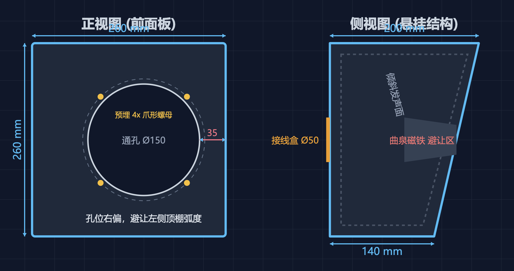

# 设计决策：全车音响

## 方案概述

基于 Alpine R600 DSP 功放的 8 通道主动分频系统。音源由 [10-smart-control](../10-smart-control/) N100 主机（Windows）、车载导航、蓝牙接收器提供，额头柜喇叭物理安装由 [07-cabinetry](../07-cabinetry/) 负责。蓝牙覆盖手机和投影仪无线连接场景。

## 系统架构

```
音源                               DSP 功放                       喇叭
───────────────────────────────────────────────────────────────────────
N100 (3.5mm AUX) ─────┐
车载导航 ──────────────┼──→ Alpine R600 ──→ CH1/2 曲泉 2" 高音（A柱）
蓝牙接收器 (RCA) ─────┘      8ch DSP      ├──→ CH3/4 曲泉 WF176BD01 6.5" 中低音（额头柜·前向）
       ▲                                   ├──→ CH5/6 6.5" 同轴（额头柜·后向）
  手机 / 投影仪                             └──→ CH7/8 Alpine SWE-1080 8" 低音炮（副驾座下）
```

## 1. 组件规格

| 组件 | 型号 | 安装位置 | 说明 |
|------|------|----------|------|
| DSP 功放 | Alpine R600（8ch DSP，RCA ×8） | N100 附近或额头柜内 | 全主动分频，31 段 EQ，PC 端调音 |
| 蓝牙接收器 | CSR8675 / QCC5125 蓝牙 5.0 接收器（RCA 输出） | 额头柜内 | 手机/投影仪蓝牙连接，RCA 接入 R600 |
| 高音 | 曲泉 2" 丝膜高音 | A 柱根部或仪表台远端 | 左右交叉对射指向后视镜下方 |
| 前中低音 | 曲泉 WF176BD01 6.5" | 额头柜·前向箱体 | 主动分频，独立木箱 |
| 后声场 | 6.5" 同轴 | 额头柜·后向箱体 | 自带分频，只需切超低音 |
| 低音炮 | Alpine SWE-1080 8" | 副驾座下 | 有源密封炮 |

## 2. 布线

| 线缆 | 起点 | 终点 | 线径 |
|------|------|------|------|
| 功放供电 | 12V 保险盒 | R600 | 4mm² |
| 蓝牙供电 | 12V 保险盒 | 蓝牙接收器 | 0.5mm² |
| 音频信号 | N100 AUX | R600 | 屏蔽音频线 |
| 蓝牙音频 | 蓝牙接收器 RCA | R600 | RCA 信号线 |
| 高音 CH1/2 | R600 | A 柱 | 1.0mm² ×2 |
| 前中低音 CH3/4 | R600 | 额头柜前向箱 | 1.5mm² ×2 |
| 后声场 CH5/6 | R600 | 额头柜后向箱 | 1.5mm² ×2 |
| 低音炮 RCA | R600 | SWE-1080 | RCA 信号线 |

## 3. 喇叭箱体制作

### 3.1 6.5" 斜面密闭音箱规格



| 参数 | 值 |
|------|-----|
| 材质 | 15mm MDF（高密度板） |
| 结构 | **纯密闭箱**，不倒相孔 |
| 高度 H | 260mm |
| 宽度 W | 260mm（正方前脸） |
| 顶部深度 D1 | 200mm |
| 底部深度 D2 | 140mm |
| 背板 | 垂直 |
| 前面板 | 倾斜（净深最浅处 >100mm，避让磁铁） |
| 喇叭通孔 | φ150mm（直通，不挖沉孔） |
| 偏心定位 | 孔边距侧板 ≥35mm |
| 预埋螺母 | 4 个爪形螺母，对角孔距 164mm |
| 接线孔 | 背板 φ50mm + 纯铜按压接线盒 |

### 3.2 箱体声学处理（施工顺序）

1. **内壁贴止震板**：丁基橡胶止震板，贴满前后左右底五个内壁（喇叭面除外），防止木板共振
2. **填充吸音棉**：聚酯纤维棉（白棉），蓬松填充 50%-70% 空间，不压死、不堵喇叭散热孔
3. **喇叭密封圈**：EVA 单面海绵胶带（宽 10-15mm，厚 2-3mm）沿开孔边缘贴一圈，防漏气
4. **穿线孔密封**：喇叭线穿出后用热熔胶或硅胶里外封死，保证气密
5. **锁螺丝**：预钻孔 + 对角线均匀锁紧

### 3.3 气密检查

装好后用手轻按喇叭纸盆，松手后应缓慢有阻尼地回弹 → 密封良好。如瞬间弹回无阻力 → 漏气，检查密封圈和接线孔。

---

## 4. DSP 调音指南

以下配置在 Alpine R600 PC 端调音软件中完成。分频点为参考值，上车后听感微调。

### 4.1 分频设置

| 通道 | 喇叭 | HPF | LPF | 斜率 |
|------|------|-----|-----|------|
| CH1/2 | 2" 高音 | **3.5kHz** | 关 | -24dB/oct LR |
| CH3/4 | 6.5" 中低音 | **80Hz** | **3.5kHz** | -24dB/oct LR |
| CH5/6 | 6.5" 同轴 | **80Hz** | 关 | -24dB/oct LR |
| CH7/8 | SWE-1080 | 25Hz（次声波切除） | **80Hz** | -24dB/oct LR |

> 如 6.5" 在小箱内发不出低频，将 CH3/4 HPF 提高到 100-120Hz，同时 CH7/8 LPF 同步提高到 100-120Hz 衔接。

### 4.2 增益与相位

- **高音增益**：高音头灵敏度高，CH1/2 Gain 先拉到 -3dB~-5dB，避免刺耳
- **其他通道**：保持 0dB，边听边调平衡
- **相位测试**：出声后播放鼓点明显的曲目，分别尝试 CH3（左中低音）反相 → 哪个模式下低音更厚实就用哪个
- **左右平衡**：驾驶位离左侧喇叭近，把左侧整体 Gain 拉低 -1dB~-2dB，让声像居中

### 4.3 低音炮设置

SWE-1080 机身旋钮设置为"直通模式"交给 DSP 接管：

| 旋钮 | 设置 |
|------|------|
| GAIN | 50%（12 点方向） |
| LP FILTER | 拧到最大（放开，由 DSP 切频） |
| PHASE | 0°（DSP 软件内切换更准） |

**低音炮混音**：在 DSP Routing 界面，将三路输入（高电平导航、AUX/N100、RCA/蓝牙）按需混合送给各通道。

**低音炮相位测试**：播放《渡口》等鼓点清晰的曲目 → 在 DSP 里切换 CH7/8 反相 180° → 鼓声变弱就切回 0°，鼓声变厚实就保持反相。

### 4.4 时延对正

量取耳朵到各喇叭的距离（单位换算：1cm ≈ 0.029ms），在 DSP 延时界面给最近的喇叭加延时，让声场聚拢到仪表台正前方。不会精算就播放人声曲目，慢慢给前门加延时直到低音炮"飞"到仪表台前。

### 4.5 EQ 盲调指南

**原则**：多做减法（Cut），少做加法（Boost）。尽量不要拉成"V"型。

**房车环境常见频段问题**：

| 症状 | 目标通道 | 频段 | 操作 |
|------|----------|------|------|
| 发闷、感冒感（小木箱驻波） | CH3/4 | 160-250Hz | ↓ -3~-5dB |
| 刺耳、听久头疼（玻璃反射） | CH1/2、CH3/4 上沿 | 2kHz-4kHz | ↓ -2~-3dB |
| 声音暗淡、没细节 | CH1/2 | 10kHz-16kHz | ↑ +1~+2dB |
| 低音轰鸣、胸口发闷 | CH7/8 | 50-60Hz | ↓ -2dB |
| 鼓声不够硬 | CH7/8 | 40Hz | ↑ +1dB |

### 4.6 调音顺序

1. **只开低音炮**：调 EQ 和音量，鼓声结实不拖沓
2. **加中低音**（静音高音）：压 200Hz 附近浑浊，让男声厚实
3. **加高音**：压 3kHz 刺耳，保留 10kHz 华丽
4. **调整左右平衡**：左侧 Gain 微降，声像居中

---

## 5. 喇叭升级方案

如果 DSP 调音后前声场仍然浑浊刺耳（确认非箱体/调音问题），考虑升级前声场喇叭（在京东自营或授权店购买，避闲鱼假货）：

| 选项 | 型号 | 价位 | 特点 |
|------|------|------|------|
| 人声通透 | 摩雷 玛仕舞 602 | ¥1000-1500 | 丝膜高音细腻，中频温润，治浑浊 |
| 解析力高 | 劲浪 165AS / ASE 165S | ~¥1500 | 亮脆，乐器分离度极高 |
| 信仰套装 | 阿尔派 R-S65C.2 | ¥1800-2000 | Type-R 系列，声音密度碾压入门级 |
